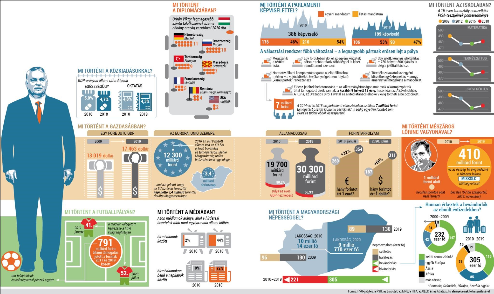

---
authors:
- HVG360
categories:
- HVG
title: "Orbán évtizede számokban - államadósság-fortély, médiacselek, bevándorlók és más trükkök"
date: "2020-07-23"
---

> https://hvg.hu/360/20200722_Orban_evtizede_szamokban__allamadossagfortely_valasztasi_cselek_bevandorlok_es_mas_trukkok

**Az egy évtizede hivatalba lépett, azóta kétszer újraválasztott Orbán-kormány a hatékony állam megteremtése jegyében levetette magáról a jogállami béklyókat, és saját ízlésére formálta Magyarországot. Sok fontos, s pár kevésbé jelentős, de nagyon is jellemző mutató felhasználásával készítettünk infografikát, hogy lássuk, mik a tények a sikerpropaganda mögött.**

A kormány szócsövei habozás nélkül értékelik ötösre saját osztálykönyvükben Orbán Viktor kabinetjeinek tízéves munkáját. Ha a realitás talaján állva osztályozzuk az évtized gazdasági, diplomáciai és társadalmi hozadékát, aligha lehetne még akár közepes érdemjegyet is adni a produkcióra. Az infografikában ezúttal nem érintett, közmunkával tupirozott munkanélküliségi adatok, valamint a mélyszegénységben élők arányának ellentmondása, vagy a két leginkább jövőorientált központi költségnem, az oktatás és az egészségügy lecsúszó pozíciója nem festenek rózsás képet a mögöttünk hagyott évekről, ugyanakkor nem kínálnak szép perspektívát az előttünk állókra sem.

A népességfogyást, ami a politika egyik fontos retorikai eleme, nem sikerült megállítani. A születésszám a tíz évvel ezelőtti alatt van, miközben a halálozások száma nem mutat csökkenést. A népesség csökkenése azért is fájó, mert az országnak - ellentétben a kormány által unalomig ismételt migrációs stoppal - jelentős bevándorlási többlete van. Apropó, bevándorlás: a statisztikák részleteit böngészve több érdekességre is bukkanhatunk. Nemcsak az orosz és török migránsok száma ugrott meg az elmúlt években (előbbiekből hét-, utóbbiakból nyolcezer érkezett az országba tíz esztendő alatt), de olyan térségekből is jelentősen növekedett a bevándorlás, amelyekre a hivatalos kommunikáció alapján nem számítanánk.

A gazdasági fejlődést legegyszerűbben kifejező mutató, a bruttó hazai termék, azaz a GDP összértéke, illetve az egy főre jutó GDP jelentősen javult - még dollárban kifejezve is. Ennek motorja nem elsődlegesen a zseniális unortodox gazdaságpolitika, hanem a kedvező világgazdasági folyamatok. A GDP forintban számítva pedig egyenesen szárnyal, köszönhetően a szinte minden más devizával szemben folyamatosan gyengülni hagyott hazai fizetőeszköznek, s nem utolsó sorban az unió euró millióinak.

Az államadóssággal kapcsolatos kormányzati sikerpropaganda is elhallgat pár fontos tényt. Valóban pozitívum, hogy 2010-et követően jelentősen csökkent a devizaadósság aránya a teljes államadósságon belül. Jelenleg elsődlegesen Magyarországon belüli szereplők felé van eladósodva az állam, s ezt bátran mondhatjuk a stabilitást elősegítő folyamatnak. Azonban az ország összadósságállománya továbbra is meredeken növekszik - azaz, leegyszerűsítve, az állam folyamatosan túlköltekezik. Forintban kifejezve több mint 50%-kal emelkedett egy évtized alatt az állami hitelállomány, ami az adósságcsökkentés szlogenjével einstandolt magánnyugdíj-vagyon nagyságához képest óriási csalódás. Igaz, ha az elmúlt időszakban dinamikusan fejlődő éves GDP-hez viszonyítjuk, csökkenő pályán van az államadósság. Azonban ennek az érvelésnek is akad szépséghibája: a jelenlegi szinteken is sokkal magasabb mint a környező, hozzánk hasonló országok azonos mutatója.

A választási rendszer törvényi meghackelése, a parlamentáris képviselet kiüresítése, a magyar médiapiac felismerhetetlenségig torzítása, valamint a rekord-hosszan bebetonozott Fidesz-káderek a jogállamiság felett őrködni hivatott szervezetekben pedig egyértelműen elégtelen osztályzattal lennének sújthatóak - már ha az értékelést végző a demokrácia és a szólásszabadság szemszögéből nézi a történéseket.
