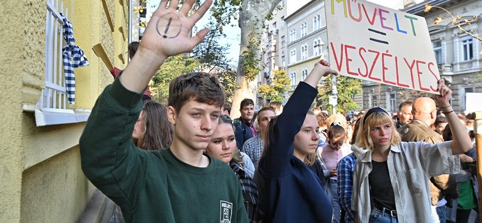

---
authors:
- hvg.hu
categories:
- HVG
title: "A Belső-Pesti Tankerületnél tüntettek a tanárok megfélemlítése ellen"
date: "2022-10-13"
---

> https://hvg.hu/itthon/20221013_A_BelsoPesti_Tankeruletnel_tuntetnek_a_tanarok_megfelemlitese_ellen
> 2022. október. 13. 16:25 2022. október. 13. 17:10 ITTHON

Több mint negyven tanár veszi át a figyelmeztető levelét.

Csütörtökön délután tüntetést szerveztek a Belső-Pesti tankerület Damjanich utcai épülete elé, ahova az Eötvös József és a Madách Imre Gimnázium korábban polgári engedetlenségben részt vevő pedagógusai közösen vonultak átvenni levelüket. Több száz szülő, diák és támogató kíséri el őket szolidaritásukat kifejezve, a tankerület épületére pedig üzeneteket ragasztottak.

"Kötelességünk kiállni a pedagógusaink, ezáltal közvetve a gyermekeink mellett is"  mondta a demonstráció egyik felszólalója, aki hozzátette, a tanárok fenyegetése helyett többek között az iskolák épületeinek állapotával és a gyerekek igényeihez igazodó tantervvel kéne foglalkozni.

Élő tudósításunk a helyszínről:

Egy mozijegy ára  elmondása szerint ennyi marad hónap végére a fizetéséből az Eötvös gimnázium felszólaló tanárának, aki azt javasolja a kormány tagjainak, hogy ha elegendőnek tartják a jelenlegi pedagógusbéreket, próbáljanak ők is ennyiből megélni. Hozzátette, azért választották a polgári engedetlenséget tiltakozási formának, mert a sztrájk kiüresítésével nem maradt más eszközük arra, hogy megmutassák, "ez így nem mehet tovább".

A helyszínen felcsendülő Illés együttes "Miért hagytuk, hogy így legyen?" slágerét hangos skandálás előzte meg, a tömeg "Nem hagyjuk!" és "Ne rúgjátok ki a tanárainkat!" rigmusokat kiabált. Többen az utóbbi hetek pedagógus-megmozdulásának jelképét, a körbe foglalt piros felkiáltójelet rajzolták tenyerükre és feltartott kézzel jelzik a tankerület felé, elfogadhatatlannak tartják a megfélemlítést, amelyet a Klebelsberg Központ konstruktív párbeszéd helyett folytat.

OKTATÁS
+
Több mint negyven tanár veszi át a figyelmeztető levelét.

Jogaikat követelő tanárok
Egyre erősödik a tanárok, diákok, szülők tiltakozása, miután az oktatási kormányzat drasztikus lépésekkel próbálja megtörni a jogaikért kiálló pedagógusok ellenállását. Az iskolai akciók összérnek, a mozgalom már az ország mind több részére kiterjed. Kövesse cikksorozatunkban a friss híreket, riportokat, interjúkat, elemzéseket.
FRISS CIKKEK A TÉMÁBAN
Tankerületvezető: „A legfontosabb az, hogy a diákok méltó körülmények között tanulhassanak”
A Belügyminisztérium előtt tankerületi leveleket égettek a diáktüntetők, majd bejelentették, hogy október 23-án folytatják
Háromezren, másfél kilométeres élőláncban tüntettek Zalaegerszegen a jobb oktatásért
Csütörtökön délután tüntetést szerveztek a Belső-Pesti tankerület Damjanich utcai épülete elé, ahova az Eötvös József és a Madách Imre Gimnázium korábban polgári engedetlenségben részt vevő pedagógusai közösen vonultak átvenni levelüket. Több száz szülő, diák és támogató kíséri el őket szolidaritásukat kifejezve, a tankerület épületére pedig üzeneteket ragasztottak.

"Kötelességünk kiállni a pedagógusaink, ezáltal közvetve a gyermekeink mellett is"  mondta a demonstráció egyik felszólalója, aki hozzátette, a tanárok fenyegetése helyett többek között az iskolák épületeinek állapotával és a gyerekek igényeihez igazodó tantervvel kéne foglalkozni.

Élő tudósításunk a helyszínről:

Egy mozijegy ára  elmondása szerint ennyi marad hónap végére a fizetéséből az Eötvös gimnázium felszólaló tanárának, aki azt javasolja a kormány tagjainak, hogy ha elegendőnek tartják a jelenlegi pedagógusbéreket, próbáljanak ők is ennyiből megélni. Hozzátette, azért választották a polgári engedetlenséget tiltakozási formának, mert a sztrájk kiüresítésével nem maradt más eszközük arra, hogy megmutassák, "ez így nem mehet tovább".

A helyszínen felcsendülő Illés együttes "Miért hagytuk, hogy így legyen?" slágerét hangos skandálás előzte meg, a tömeg "Nem hagyjuk!" és "Ne rúgjátok ki a tanárainkat!" rigmusokat kiabált. Többen az utóbbi hetek pedagógus-megmozdulásának jelképét, a körbe foglalt piros felkiáltójelet rajzolták tenyerükre és feltartott kézzel jelzik a tankerület felé, elfogadhatatlannak tartják a megfélemlítést, amelyet a Klebelsberg Központ konstruktív párbeszéd helyett folytat.

Epres Attila színész is felszólalt
© Túry Gergely
"Madáchos vagyok! És eötvösös és kölcseys is"  kezdte beszédét Madarász Éva színésznő, aki a Madách gimnázium diákja volt és úgy érzi, az iskolához fűződő érzelmei nem múltak el az évek alatt, a pedagógusokkal való szolidaritás csak felerősítette azokat, ráadásul a többi iskola tanárai mellett is kötelessége kiállni  ahogy mindenkinek az kéne, hogy legyen. Hangsúlyozta, elsősorban nem csak tantárgyakat tanulni járnak iskolába a gyerekek, hanem olyan, nélkülözhetetlen értékrendet, amit csak szabadon dolgozó tanárok tudnak átadni.

Az őszi tiltakozási hullámot a Pál utcai fiúk történetével állította párhuzamba: ki kell állni amellett, ami igazán fontos számunkra. Beszéde után a tüntetések védjegyévé vált "Legyen miénk a Grund!" című szám szólalt meg a hangszórókon, amelyet a tömeg töretlen lelkesedéssel énekelt el.

"Azt akarják, hogy kiürüljenek az iskolák?"  tette fel a kérdést egy madáchos tanár, aki úgy érzi, a kormányzatban és a tankerületekben a legkisebb hajlandóság sincsen arra, hogy rendezzék az oktatás helyzetét.

A rendezvény végén az egyik szervező szülő egy perc néma csendet kért, ezután elhangzott a Himnusz is. "Holnap találkozunk!"  köszönt el a férfi, aki elmondta, nem profi rendezvényszervező, "csak egy családapa", aki aggódik.

Az V., VI. és VII. kerület oktatási intézményeit felügyelő hivatalt Marosi Beatrix vezeti, tőle származott a szeptember végén azonnali hatállyal kirúgott öt kölcseys tanár felmondólevele is.

