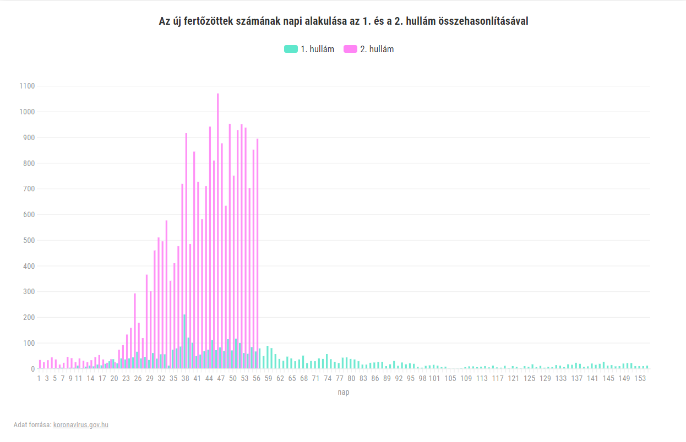

---
authors:
- Bolcsó Dániel
categories:
- Telex
title: "Magyarországot telibe kapta a második hullám, és még csak most jön a java"
date: "2020-09-28"
---

> https://telex.hu/koronavirus/2020/09/28/magyarorszagot-telibe-kapta-a-masodik-hullam-es-meg-csak-most-jon-a-java

-   Magyarországon már javában tart a koronavírus-járvány második
    hulláma. A tavaszi első hullám sikeres kezelése után most arányaiban
    Európa legfertőzöttebb országai között vagyunk, sorban dőlnek a napi
    fertőzöttségi rekordok, és a halálesetek száma is újra rekord
    szintre emelkedett.
-   Cikkünkben összefoglaljuk a magyarországi járványhelyzet
    legfontosabb tudnivalóit, és megnézzük, mire lehet számítani a
    következő hónapokban. Ha lehet hinni az előrejelzéseknek, akkor nem
    sok jóra.
-   Van-e hasonlóság a félreértett svéd modellel? Volt értelme lezárni
    a határt? Na és kinyitni az iskolákat? Már többet tesztelünk, de még
    mindig nem eleget, nem elég hatékonyan, és egyre kevésbé győzzük
    kapacitással.
-   Lélegeztetőgépből rengeteget vettünk, és kórházi ágy is van bőven.
    De ez tényleg azt jelenti, hogy az egészségügy mindenre készen
    áll?
-   Újra lehet fertőződni a vírussal, de az immunitásról szóló hírek
    így is biztatók. A vakcina is gőzerővel készül, csak legyen kinek
    beadni a sok járványtagadó között.

Ahogy az borítékolható volt, a tavaszi első felvonás után ősszel
Magyarországra is megérkezett a koronavírus-járvány második hulláma. A
vírus az egész világon terjed, eddig már több mint 34 millióan
fertőződtek meg, a halálos áldozatok száma pedig átlépte az egymilliót.
A nyár végével több helyen is újra felgyorsult a terjedés üteme, és
szeptember 18-án rekordot döntött a [napi új esetek
száma](https://www.worldometers.info/coronavirus/coronavirus-cases/#daily-cases):
egyetlen nap alatt több mint 322 ezer fertőzöttet regisztráltak a
világon. Mégis kevés országban ugrott meg olyan drámai arányban a
fertőzöttek száma augusztus végétől, mint Magyarországon. Szeptember
végén az Európai Betegségmegelőzési és Járványvédelmi Központ (ECDC) is
[vörös zónába
sorolta](https://444.hu/2020/09/29/magyarorszag-is-voros-zonaba-kerult-az-europai-jarvanyugy-koronaterkepen)
az országot.

\"El kell keserítsek mindenkit, Magyarország Franciaország után a
második helyre zárkózott fel a lakosságra vetített járványterjedési
számokban. Megelőzve ezzel Spanyolországot, és messze megelőzve
Olaszországot. Magyarországon Európához képest brutálisan tombol a
járvány a lakosságra vetített számok alapján. Ez a fekete igazság\" --
[mondta](https://444.hu/2020/09/15/jakab-ferenc-magyarorszagon-europahoz-kepest-brutalisan-tombol-a-jarvany)
Jakab Ferenc, a Pécsi Tudományegyetem Szentágothai János Kutatóközpont
Virológiai Kutatócsoportjának és a kormány által tavasszal felállított
Koronavírus-kutató Akciócsoportnak a vezetője egy online közvetített
[beszélgetésen](https://www.youtube.com/watch?v=K2mlwvmEaeE&ab_channel=PTE1367).
\"Nem lesz egy jó hangulatú őszünk\" --
[mondta](https://koronavirus.gov.hu/cikkek/orban-az-orszagnak-mukodnie-kell-es-kozben-fegyelmezetten-kell-vedekezni)
Orbán Viktor miniszterelnök is.

> "Ha így rohanunk a vesztünkbe, akkor az egészségügyi kapacitásunkat
> ki fogjuk meríteni. Nem látjuk, hogy a járvány csúcsosodna vagy
> platózna, a számok emelkednek, és napról napra több lesz"

--
[fogalmazott](https://hvg.hu/itthon/20201001_Jakab_Ferenc_Semmi_ertelme_az_iskolai_lazmeresnek)
még radikálisabban Jakab Ferenc már október 1-jén.

Rekordokat dönt a magyarországi járvány
=======================================

Itthon az első hullámban a legmagasabb napi esetszámot 210 igazolt
fertőzöttel értük el (április 10-én), de ez is kiugrónak számított, a
következő legmagasabb érték a 120 volt, majd a nyáron rendszeresen tíz
alatt maradt ez a szám. A százat augusztus 28-án lépte át újra a napi
számláló 132 új fertőzöttel, és a járvány fokozódását jelzi, hogy azóta
nem is ment újra száz alá, a cikk megjelenésekor már az ezer fölötti
régióban mozog. A tavaszi maximumot augusztus 30-án haladta meg először
a napi esetszám, 292 új fertőzöttel. [Október
2-án](https://koronavirus.gov.hu/cikkek/1322-fovel-emelkedett-beazonositott-fertozottek-szama-es-elhunyt-17-beteg)
pedig egyetlen nap alatt 1322 új fertőzöttet azonosítottak, ami a
járvány kezdete óta abszolút rekord.

Az aktív fertőzöttek száma egyetlen nap kivételével augusztus 6. óta
folyamatosan emelkedik, a cikk megjelenésekor, [október
3-án](https://koronavirus.gov.hu/cikkek/1086-fovel-emelkedett-beazonositott-fertozottek-szama-es-elhunyt-14-kronikus-beteg)
22 081 volt -- ez a május 4-i tavaszi maximum több mint tízszerese,
akkor 2054 fő volt egyszerre fertőzött Magyarországon. Az aktív betegek
közül 704 főt ápolnak kórházban, közülük 43-en vannak lélegeztetőgépen,
a kórházi ellátásra szorulók száma [bevallottan egyre
emelkedik](https://koronavirus.gov.hu/cikkek/orszagos-tisztifoorvos-egyre-tobb-embert-kezelnek-korhazban),
és pénteken a halálesetek száma is rekord szintre kúszott vissza 17 napi
új áldozattal. (Erre később még visszatérünk.) A járvány kezdete óta
azonosított összes fertőzött száma 29 717, közülük 812-en meghaltak,
6349-en már meggyógyultak.

Érzékletesen mutatja az első és a második hullám közötti nagyságrendi
különbséget az [Átlátszó
grafikonja](https://public.flourish.studio/visualisation/3656310/),
amelyen a tavaszi és az őszi időszak napi esetszámait vetítették
egymásra (a szeptember 30-i állás alapján):

De mi az oka annak, hogy ennyire berobbant most a járvány?

> \"Nem történt semmi meglepő, magyarázatot az igényelt volna, ha nem ez
> történik. A mostani helyzet teljesen megfelel a várakozásoknak: tavasz
> óta nem alakult ki érdemi védettség, de feloldottuk a korlátozásokat,
> amiket meg nem, azoknál is lényegesen visszaesett a betartási
> hajlandóság. Minden bizonnyal tavasszal is ez lett volna a lefutás, ha
> nincsenek azok az intézkedések, amiket akkor időben meghoztak, és
> amiket az emberek nagy arányban be is tartottak\"

-- mondta a Telexnek Ferenci Tamás klinikai biostatisztikus,
orvosbiológiai mérnök, az Óbudai Egyetem Élettani Szabályozások
Kutatóközpontjának docense, a járvány során a kormány munkáját segítő
Járványmatematikai Modellező és Epidemiológiai Munkacsoport tagja.

Miben más a második hullám?
===========================

Alapvető különbségek vannak a tavaszi járványhullám lefolyása és a
mostani helyzet között. Ez már nem mérsékelt tempóban, gócpontosan,
leginkább kórházakban és szociális intézményekben terjedő, elsősorban
időseket fertőző járvány; a vírus ezúttal szélesebb hazai közösségekben
és egyelőre inkább a fiatalok között terjed, méghozzá jelentősen
gyorsabban.

A vírus terjedési ütemének legfontosabb mércéje a reprodukciós szám. Ez
azt mutatja meg, hogy egy fertőzött átlagosan hány további embert fertőz
meg. A cél ennek a számnak az 1 alatt tartása, mert akkor kevesebb az új
fertőzött, mint az addigi, azaz a járvány visszaszorulóban van. Oroszi
Beatrix, a Nemzeti Népegészségügyi Központ (NNK) járványügyi szakértője,
a kormányt segítő munkacsoport epidemiológiai csapatának vezetője egy
konferencián [arról
beszélt](https://www.napi.hu/magyar_gazdasag/koronavirus_a_modellek_alapjan_rovidesen_sokkal_durvabb_szamok_johetnek.712685.html),
hogy augusztus végén volt olyan időszak, amikor a reprodukciós számot
már 2-2,5 közöttire becsülték, azaz a vírus a [tavaszinál jóval nagyobb
sebességgel](https://research.physcon.uni-obuda.hu/COVID19MagyarEpi/)
terjedt -- ez ráadásul még az esetszámok látványosabb megugrása előtt
volt. (Azóta azért mérséklődött a reprodukciós szám, és inkább 1,3
körülre kezdett beállni.)

Galgóczi Ágnes, az NNK járványügyi főosztályvezetője szeptember elején
[azt
mondta](https://magyarnarancs.hu/katasztrofa/nepegeszsegugyi-kozpont-26-ev-az-oszi-koronavirus-fertozottek-atlageletkora-132903),
míg tavasszal 67 év volt a hazai fertőzöttek átlagéletkora, az őszi
hullámban már csak 26. [Több oka is
lehet](https://www.facebook.com/virologiapecs/posts/180205046892406)
annak, hogy a fiatalok kerültek most a járvány középpontjába: mivel
többet tesztelünk, mint tavasszal, nagyobb arányban derítjük fel a
tünetmentes fertőzötteket, akik között jellemzően több a fiatal, mint a
tünetesek között. Az idősek pedig, mivel ők a veszélyeztetett
korosztály, elővigyázatosabbak lehetnek. De a legvalószínűbb a
fordítottja, azaz hogy a fiatalok lettek kevésbé elővigyázatosak.

Mivel azt már mindenki kívülről fújja, hogy ez a vírus elsősorban az
idősekre és a krónikus betegekre veszélyes, első hallásra megnyugtató
lehet, hogy ezúttal nem közöttük, hanem inkább a fiatalok között terjed,
hiszen ők jó eséllyel olcsón megússzák, ha egyáltalán észreveszik, hogy
megfertőződtek. (Bár érdemes megjegyezni, hogy sokkal ritkábban ugyan,
de a fiatalabbak körében is kialakulhat súlyos lefolyású betegség,
[Magyarországon is
vannak](https://koronavirus.gov.hu/cikkek/orszagos-tisztifoorvos-jarvany-felszallo-szakaszaban-vagyunk)
fiatal fertőzöttek lélegeztetőgépen.)

Csakhogy a fiatalok valójában a járvány motorjaiként funkcionálnak.
Jellemzően több emberrel érintkeznek, több helyen járnak, így
potenciálisan szélesebb körben terjesztik a fertőzést, és nehezebb
felderíteni a kontaktjaikat (ezzel a jelek szerint [meg is gyűlik a
hatóságok
baja](https://www.valaszonline.hu/2020/09/07/koronavirus-egyetemek-kalifornia-hatas-elemzes/)).
Ez különösen kockázatos egy olyan vírus esetében, amelyről mára
bebizonyosodott, hogy az összes fertőzött [20-31 százalékát
kitevő](https://journals.plos.org/plosmedicine/article?id=10.1371/journal.pmed.1003346)
tünetmentes fertőzöttek is hatékonyan képesek továbbadni.

A fiatalok így jó eséllyel az időseknek is átadják a fertőzést
előbb-utóbb. A veszélyeztetetteket elvileg lehet fokozottabban védeni --
és kell is, a magyar intézkedések egy része is ezt a célt szolgálja --,
de az eddigi tapasztalatok alapján életszerűtlen, hogy a kockázati
csoportok küszöbénél huzamosabban meg lehessen állítani a vírust. Éppen
ez volt az például, ami Svédországban is látványos kudarcot vallott.

Az a bizonyos svéd modell
=========================

Itt érdemes egy kitérőt tenni, mert Svédország megítélése az egész
járvány egyik legnagyobb figyelmet kapó kérdése, és a történet az ősz
beköszöntével új lendületet kapott.

A svéd modellként elhíresült járványkezelési megközelítés úgy vonult be
a köztudatba, hogy a svédek a lovak közé dobták a gyeplőt, azaz engedték
szabadon terjedni a vírust, annak reményében, hogy a nagy átferdőződés
révén gyorsan kialakul a teljes lakosságot védő közösségi vagy --
régebbi szóval -- nyájimmunitás. Az első hullám végére azonban a világ
nagy része elkönyvelte, hogy a svéd modell zsákutca, mert
lakosságarányosan nemcsak a fertőzések száma szaladt meg nagyon, de
jelentősen többen is haltak meg, mint a környező országokban, és még
csak a közösségi immunitáshoz sem kerültek jelentősen közelebb. Aztán
augusztus közepén, miközben Európa nagy részén épp meredek emelkedésnek
indultak a napi új esetszámok, Svédországban csökkenő tendencia indult
el, amire újra felerősödött a svéd modell igazát hirdetők hangja. Az
alábbi
[grafikonon](https://ourworldindata.org/coronavirus-data-explorer?zoomToSelection=true&time=2020-03-01..latest&country=SWE~ITA~Europe~ESP~HUN~FRA&region=World&casesMetric=true&interval=smoothed&hideControls=true&perCapita=true&smoothing=7&pickerMetric=total_deaths&pickerSort=desc)
látszik, hogy szeptember végére a svéd esetszámok is újra elindultak
felfelé, de a különbség így is látványos:

A látszólagos ellentmondás egy alapvető félreértésből adódik. \"Gyakran
leegyszerűsítve jelenik meg a svéd modell a közbeszédben, de valójában
nem arról van szó, hogy ők nem tettek semmit a járvány ellen. Sőt sok
intézkedésük célja egész hasonló volt, mint a legtöbb országban, csak
más úton, kényszer helyett inkább meggyőzéssel akarták elérni nagyjából
ugyanazt\" -- mondta Ferenci Tamás. Egyrészt azért Svédországban is
életbe léptek kötelező érvényű korlátozások, ott is volt például
látogatási tilalom, távoktatás a középiskolákban, tömegrendezvényekre
vonatkozó tiltás és hasonlók. (Egyedül a kötelező maszkhasználat
hiányzik látványosan a palettáról, annak a bevezetése [jelenleg is
vitatéma](https://www.bloomberg.com/news/articles/2020-08-18/sweden-s-face-mask-debate-heats-up-amid-covid-resurgence-warning)
az országban.) Másrészt a járványügyi hatóság további, nem törvényileg
előírt javaslatait is viszonylag nagy arányban követte a lakosság.

Csakhogy ezek az intézkedések az első hullámban, amikor a legtöbb ország
úgy döntött, hogy a váratlan és ismeretlen vírus ellen biztosra kell
menni, még enyhének számítottak. A második hullámban azonban, aminek
minden ország felkészültebben és a vírust jobban ismerve indul neki, és
igyekszik elkerülni a teljes leállást, ugyanezek a korlátozások már
egészen szigorúnak minősülnek. A járványt tehát Svédországban sem a
közösségi immunitás tartja most kordában -- hiszen az [továbbra is
messze van](https://twitter.com/zorinaq/status/1302132457014095872) --,
hanem a részben kötelező, részben önkéntesen végrehajtott [közösségi
távolságtartás](https://twitter.com/zorinaq/status/1290041867136978944).

Hogy ezúttal meddig sikerül viszonylagosan úrrá lenni a vírus terjedésén
az országban, még nem tudni, ahogy azt sem, hogy a halálozások mennyire
szabadulnak majd el. Az mindenesetre tény, hogy [bő 150 éve nem haltak
meg
annyian](https://www.businessinsider.com/coronavirus-sweden-highest-death-toll-150-years-lockdown-herd-immunity-2020-8)
fél év alatt Svédországban, mint idén januártól júniusig. Ennek a fő oka
-- és amiről biztosan látszik, hogy elrontották a svédek, még a saját
véleményük szerint is --, hogy az idősotthonokat nem tudták megvédeni.
(A vezető svéd epidemiológus, Anders Tegnell szerint [az is
közrejátszhatott](https://www.cnbc.com/2020/09/23/swedens-high-coronavirus-death-toll-could-be-linked-to-a-mild-flu-season-chief-scientist-says.html)
a magas halálozásban, hogy a megelőző influenzaszezonok enyhébben voltak
az országban.) De a végső ítélettel, hogy a svéd modell végül milyen
arányban kudarc vagy siker, valójában még sokat kell várni. \"Irigylem
azok magabiztosságát, akik most megmondják akár azt, hogy jó, akár azt,
hogy rossz volt, amit a svédek csináltak. Látszanak bizonyos dolgok, de
ezt majd öt év múlva fogjuk egyértelműen tudni. Viszont a döntéseket
most kell meghozni" -- mondta Ferenci Tamás.

Enyhébb korlátozások, elkésett határzár
=======================================

De kanyarodjunk is vissza Magyarországhoz, ahol az első hullám
korlátozásaihoz képest most jóval visszafogottabb járványügyi
intézkedések vannak hatályban, mert a kormány álláspontja szerint az
élet nem állhat le újból, a gazdaságnak is tovább kell működnie. Orbán
Viktor [explicitté is
tette](https://mediaklikk.hu/miniszterelnoki-interjuk/cikk/2020/09/11/orban-viktor-miniszterelnoki-interju-jo-reggelt-magyarorszag-szeptember-11/),
hogy nem kell a tavasziakhoz hasonló mértékű korlátozásokra számítani.

Jelenleg a
[következő](https://koronavirus.gov.hu/cikkek/orban-viktor-az-egeszsegugy-felkeszult-jarvany-kovetkezo-hullamanak-kezelesere)
főbb védelmi
[intézkedések](https://koronavirus.gov.hu/cikkek/orban-viktor-az-idosek-es-betegek-erdekeben-tartsuk-be-szabalyokat)
érvényesek:

-   Határzár: főszabály szerint szeptember 1-től külföldiek nem
    léphetnek az országba, a magyarokra pedig a hazatérés után karantén
    vár, amelyet csak két negatív teszttel hagyhatnak el.
-   Az eredetileg a tömegközlekedésre és boltokra érvényes kötelező
    maszkviselést kiterjesztették a mozikra, színházakra, egészségügyi
    és szociális intézményekre és ügyfélfogadási irodákra is.
-   [Látogatási
    tilalmat](https://koronavirus.gov.hu/cikkek/teljes-koru-latogatasi-tilalmat-rendelt-el-korhazakban-az-orszagos-tisztifoorvos)
    vezettek be a kórházakban és az idősotthonokban, a szülők pedig nem
    mehetnek be az iskolákba.
-   Hatósági árat vezettek be a tesztekre, a korábbi 30 ezer forint
    körüli ár helyett maximum 19 500 forintot lehet elkérni egy
    PCR-tesztért. (Ha orvos, kórház vagy hatóság rendeli el, [továbbra
    is
    ingyenes](https://koronavirus.gov.hu/cikkek/domotor-ha-tesztelest-haziorvos-rendeli-el-ingyenes-teszt).)
-   Kötelező lázmérést kell végezni az iskolákba belépő diákokon és
    tanárokon október 1-től.
-   Mindenki, aki kéri, ingyen kap [influenza elleni
    oltást](https://www.facebook.com/telexhu/posts/145656087231288),
    hogy [a két járvány
    találkozása](https://mta.hu/tudomany_hirei/a-covid-jarvany-es-az-influenzavirusok-kozelgo-idoszaka-110852)
    ne eszkalálja a helyzetet.
-   23 órakor minden szórakozóhelynek be kell zárnia.
-   Az első bejelentésekben valamiért nem emelték ki, de az új szabályok
    között [szerepel az
    is](https://turizmus.com/utazas-kozlekedes/10-napra-rovidul-a-karantenkotelezettseg-magyarorszagon-1171714),
    hogy a külföldről hazatérőkre váró karantén 14 napról 10-re
    csökkentik.

Abban szinte minden szakértő egyetért, hogy a fenti lépések jó irányba
mutatnak, de az kérdéses, hogy elégségesek-e, illetve a kivitelezésük
részletei is vitathatók. A tesztek hatósági ára például akár
[kontraproduktívnak is
bizonyulhat](https://444.hu/2020/09/17/tobb-teszt-nem-lesz-a-hatosagi-artol-de-kevesebb-meg-lehet),
mert hiába nő meg a kereslet az olcsóbb tesztek iránt, ilyen áron
várhatóan kevesebb szolgáltató fogja tudni elvégezni ezeket. Volt olyan
labor, amely rögtön a bejelentés után
[felfüggesztette](https://www.pentacorelab.hu/hirek/1636-2020-09-17-covid-pcr-azmeneti-felfugesztese)
a mintavételt, de összesen már [legalább tíz
szolgáltató](https://444.hu/2020/09/22/megerkezett-a-hatosagi-ar-tobb-szolgaltato-leallt-a-tesztelessel)
hagyott fel emiatt a teszteléssel.

A kötelező iskolai lázmérést sem fogadták kitörő lelkesedéssel a
szakértők. Jakab Ferenc például [azt
mondta](https://hvg.hu/itthon/20201001_Jakab_Ferenc_Semmi_ertelme_az_iskolai_lazmeresnek),
sem szakmailag, sem járványügyileg nem indokolt az intézkedés, mert a
tünetek fellépése előtt gyakran nem jelentkezik láz, a végig tünetmentes
fertőzötteknél meg pláne, de ettől még ők is képesek lehetnek továbbadni
a vírust. A mérésre tömött sorokban váró gyerekek ráadásul könnyen
megfertőzhetik egymást.

A legnagyobb kérdés azonban a határzár haszna. Bár a nyári hónapokban
valóban sok járványügyi szakembertől lehetett hallani, hogy a vírus
külföldről behurcolva térhet vissza, a határzár bevezetésekor ezen a
fázison már rég túl voltunk. Az NNK-s Oroszi Beatrix a már idézett
előadásában [azt
mondta](https://www.napi.hu/magyar_gazdasag/koronavirus_a_modellek_alapjan_rovidesen_sokkal_durvabb_szamok_johetnek.712685.html),
az augusztus 1. és 29. között regisztrált 1453 új fertőzésből már csak
161 eset, azaz 11 százalék volt köthető külföldi fertőzéshez. Ez az
arány ráadásul folyamatosan csökkent, a határzár bevezetésekor már a 10
százalékot sem érte el:

> \"A behurcolások aránya július végén-augusztus elején volt érdemi.
> Azon el lehet vitatkozni, hogy akkor lett volna-e értelme a
> határzárnak, de amikor meglépték, akkor már gyakorlatilag mindegy
> volt. A szakértői csoport is jelezte már augusztusban is, hogy a
> belföldi terjedés a lényeges, ami azóta teljes mértékben be is
> igazolódott"

-- mondta Ferenci Tamás.

Arra a felvetésünkre, hogy legalább a vírus utánpótlásának elvágása
legitim célja lehet-e a határok lezárásának, Ferenci azt mondta, ez
elfogadható érvelés, \"de annak akkor sincs értelme, hogy az
intézkedések 90 százalékát az esetek 10 százalékát adó forrásra
fókuszáljuk\", utalva arra, hogy a határzár léptékében és a kormány
kommunikációjában is egészen a közelmúltig a fő járványvédelmi
intézkedésnek számított. \"Ráadásul ez az egész megelőzhető lett volna
azzal, ha naponta, nyilvánosan közlik a behurcolt esetek százalékos
arányát, ami érzésem szerint semmi mást nem igényelt volna, mint annak
eldöntését, hogy felnőttnek tekintik a magyar embereket\" -- tette hozzá
Ferenci.

Gulyás Gergely az október 1-jei kormányinfón
[bejelentette](https://www.portfolio.hu/gazdasag/20201001/gulyas-gergely-egyelore-nincs-dontes-az-orvosi-berekrol-de-jelentos-emelest-tervezunk-451032),
hogy a határzárat egy hónappal meghosszabbítják.

De nehéz az iskolatáska
=======================

Miközben egyes korlátozások haszna megkérdőjelezhető, akadnak olyan
lehetséges lépések is, amelyeknek épp az elmaradása váltott ki nagy
vitát. A legfőbb ilyen, sokak által hiányolt korlátozás az iskolák
újbóli bezárása, mert az iskolakezdéssel jelentősen megnő a
kontaktusszám, nemcsak a gyerekek, hanem például a szülők, tanárok
között is, ami a vírus terjedésének gyorsulásához vezethet. Az
iskolabezárás azonban az ország leállása vagy működőképessége
szempontjából is szimbolikus ügynek tekinthető, hiszen a tavaszi
kényszertávoktatás a diákok és a tanárok mellett a társadalom egészére
is komoly terhet rótt.

Bár ma már tudjuk, hogy a jellemzően tünetmentes gyerekek is képesek
továbbfertőzni, így lehet szerepük a vírus terjesztésében, összességében
úgy tűnik, az iskolák kinyitása nem jelent vállalhatatlan járványügyi
kockázatot. Fontos lenne azonban [differenciáltan kezelni a különböző
korosztályokat](https://qubit.hu/2020/08/31/mennyire-veszelyes-az-iskolakezdes-a-jarvany-idejen),
mert a középiskolások a jelek szerint már inkább a felnőttekhez
hasonlítanak járványügyi szempontból (az egyetemisták pedig ugye már
maguk is felnőttek), így az összeeresztésük is kockázatosabb. Másrészről
az ő otthontartásuk a legkisebb veszteség társadalmi értelemben, hiszen
nem vonja ki automatikusan a szülőket a munkából, ráadásul minél
nagyobbakról van szó, annál működőképesebb lehet az online oktatás is. A
fiatalabb korosztályoknál viszont elmondható, hogy a felnőtt pedagógusok
inkább egymásra jelentenek veszélyt, mint a gyerekekre vagy ők rájuk,
így az iskolai védekezésben is erre érdemes összpontosítani.

Az iskolanyitás hatása azonban attól is függ, milyen járványhelyzetben
lépjük meg: ha visszafogottabb terjedés mellett nyitnak az iskolák, és
ettől emelkedik a reprodukciós szám, az jó eséllyel még mindig kezelhető
szint, de ha már alapból magas a reprodukciós szám, azaz gyors terjedés
idején indul a hagyományos oktatás, az nagy járványhoz vezethet --
mondta a [Portfoliónak adott
interjújában](https://www.portfolio.hu/gazdasag/20200831/figyelmeztet-a-jarvanyugyi-matematikus-a-koronavirus-terjedes-magyar-mutatoja-veszelyes-szintre-emelkedett-446626)
Röst Gergely járványügyi matematikus, a kormányzati döntéseket segítő
munkacsoport matematikai modellező csoportjának vezetője.

Bár az intézmények szeptember 1-jén kinyitottak, ahol felüti a fejét a
vírus, ott menet közben is változhat a helyzet. Orbán Viktor szeptember
12-én [azt
mondta](https://www.facebook.com/orbanviktor/videos/972711966528655),
addig 3 iskolát és 16 óvodát kellett bezárni a járvány miatt, de azóta
is érkeznek a hírek iskolai fertőzésekről. Egy [pécsi
iskolában](https://www.pecsma.hu/top/het-osztalyt-hazakuldtek-a-pte-gyakorlo-iskolajabol/)
például egy tanár megfertőződése után hét osztályt küldtek haza, és
további öt tanár került járványügyi megfigyelés alá.
[Szombathelyen](https://www.nyugat.hu/cikk/koronavirus_fertozes_derkovits_iskola_szombathely)
is hét osztály került karanténba. Egy [miskolci
iskolában](https://444.hu/2020/09/15/ketsegbeesett-levelben-magyarazza-a-szuloknek-az-iskolavezetes-hogy-hiaba-terjed-a-virus-napok-ota-nem-kapnak-segitseget)
négy tanár bizonyult fertőzöttnek, de az intézmény hiába adta le a
kontaktjaikat az illetékes állami szervnek, napok alatt sem történt
semmi. Egy [budapesti
iskolában](https://24.hu/belfold/2020/09/14/lauder-javne-iskola-tomeges-teszteles-30-fertozott/)
közösségi finanszírozásban kezdtek saját tesztprogramba, és rögtön
találtak is 30 fertőzöttet. Egy másik [budai
iskolában](https://444.hu/2020/09/16/egy-budai-iskolaban-az-egyik-alsos-evfolyam-4-tanarabol-3-otthon-van-es-arra-varnak-hogy-vegre-leteszteljek-oket)
több mint három napot kellett várniuk a koronavírusos tüneteket
produkáló tanároknak, hogy elvégezzék rajtuk a tesztet -- és [lehetne
még
sorolni](https://qubit.hu/2020/09/23/interaktiv-terkepen-a-jarvanyban-erintett-iskolak).
A cikk megjelenésekor épp 6 iskolában és 33 óvodában [volt
érvényben](https://koronavirus.gov.hu/cikkek/848-fovel-emelkedett-beazonositott-fertozottek-szama-es-elhunyt-16-beteg)
rendkívüli szünet a fertőzés megjelenése miatt, digitális tanrendre
pedig 5 teljes iskolában és további 121 osztályban álltak át.

A pedagógusok elsősorban a fejetlenségre
[panaszkodnak.](https://24.hu/belfold/2020/09/26/koronavirus-oktatas-iskola-teszteles-karanten/)
Az érintett iskolákra nincs egységes protokoll, a tesztelési gyakorlat
is kaotikus, és a karanténkötelezettség megállapítása is következetlen,
mindez pedig a szakszervezetek szerint kiszámíthatatlan és kockázatos
helyzetet eredményez.

Amíg nincs sok halott, nem szigorítunk
======================================

Orbán Viktor a járvány alatt általában néhány perces Facebook-videókban
jelentkezik be fontosabb kormányülések után, szeptember 12-én este
azonban [hosszabb interjút adott az
M1-nek](https://hirado.hu/belfold/video/2020/09/12/orban-viktor-magyarorszagnak-mukodnie-kell).
Itt egyben is elmondta a kormány járványügyi megközelítésének
sarokpontjait, érdemes ezeket egyben is felidézni:

-   Annyival kedvezőbb most a helyzet, mint az első alkalommal, hogy már
    nem ismeretlen az ellenség, és az egészségügyi ellátórendszert sem
    éri felkészületlenül, mert tavasszal sikerült időt nyernünk.
-   Ezért most a cél, hogy elkerüljük a komolyabb lezárásokat, mert az
    ország nem állhat le újból.
-   Ehhez az kell, hogy azokat az enyhébb korlátozásokat, amelyeket
    viszont meghoztak, tényleg tartsák is be az emberek; ezúttal ezt
    szankciókkal és hatósági erővel komolyabban be is fogják tartatni.
-   Mivel most máshogy védekezünk, mint az első hullám alatt, ezért most
    a halálesetek számát érdemes figyelni, nem a fertőzöttekét.

Mivel a szakértői konszenzus szerint épp a fegyelmezett maszkviselés és
távolságtartás lehet a leghatékonyabb fegyver a járvány ellen, mégis
sokunk személyes tapasztalata és az [Ipsos reprezentatív
felmérése](https://www.ipsos.com/hu-hu/masodik-hullam-egyelore-nincs-korlatozo-hatassal-eletunkre)
alapján is épp az egyéni fegyelem látszik lankadni mostanra, a
korlátozások hatékonyságának növelése valóban hozhat számottevő
eredményt. Az más kérdés, hogy ezt bírságolással vagy például
hatékonyabb tájékoztató kampányokkal érdemes-e elérni.

Mindenesetre már született is néhány szankcionáló intézkedés, a fővárosi
tömegközlekedési eszközökön maszk nélkül utazók például [8 ezer forintos
büntetésre](https://hvg.hu/itthon/20200908_birsag_buntetes_bkv_bkk_arcmaszk_maszk_koronavirus)
számíthatnak; a helyközi buszokon és vonatokon pedig nem szállhat fel,
illetve le kell szállnia annak, aki nem hord maszkot, ha pedig ezt
megtagadja, [10-50 ezer forintos
bírságot](https://www.portfolio.hu/gazdasag/20200909/koronavirus-szigoritas-jon-a-vonatokon-es-a-buszokon-leszallitjak-a-maszk-nelkulieket-birsag-is-lesz-448072)
fizethet.

Vigyázó szemetek Floridára vessétek
===================================

Orbán kijelentése, hogy a halottak számát kell figyelni, elsőre
logikusnak tűnhet, hiszen amíg csak a fiatalok fertőződnek, és nem
halnak meg sokan, addig nincs olyan nagy gond. A nemzetközi trendek
azonban arra utalnak, hogy ez a kedvező állapot jó eséllyel csak
átmeneti. \"Ha a szimpla adatokat nézzük, már lehet látni, hogy a
halálesetek a következő hetekben nagyon meg fognak emelkedni\" --
[mondta](https://444.hu/2020/09/15/jakab-ferenc-magyarorszagon-europahoz-kepest-brutalisan-tombol-a-jarvany)
szeptember közepén Jakab Ferenc.

A
[szakértők](https://www.facebook.com/virologiapecs/posts/180205046892406)
szerint a [floridai
példát](https://www.vox.com/future-perfect/2020/7/17/21324398/florida-coronavirus-covid-cases-deaths-outbreak)
érdemes figyelni, mert eddig mifelénk is hasonló forgatókönyv szerint
zajlik a második hullám. Florida júliusban úgy vált az egyik
legfertőzöttebb amerikai állammá, hogy [eleinte a fiatalok kapták
el](https://twitter.com/nataliexdean/status/1283134585665200131) a
vírust, de a fertőzés kis fáziskéséssel az egyre idősebb korosztályokra
is átterjedt. (És szeptember közepén ugyanott [kísértetiesen hasonló
folyamat](https://twitter.com/DrEricDing/status/1304358571061243906)
indult be újból.) Eleinte Floridában is kevésbé aggódtak az esetszámok
emelkedése miatt, mert a kórházi kezelésre szorulók és halálos áldozatok
száma nem nőtt. Aztán néhány héttel eltolva ezek is megindultak felfelé.

Eszerint a fiatalok megfertőződése jó eséllyel itthon is csak a kezdet,
a következő szakaszban a fertőzési láncolatok már az idősebb
korosztályokat is nagyobb számban érik el. Várhatóan 4-5 hét csúszással
nálunk is nőni fog a kórházi kezelésre szoruló betegek, majd további 2-4
héttel később a halálesetek száma is. Ha tehát a floridai példát nézzük,
felmerül a kérdés, hogy nem épp most lenne-e itt az ideje a
határozottabb cselekvésnek, mert ha Orbán szavait követve csak akkor
szigorítunk, amikor a halálesetek száma is megindul felfelé, már késő
lehet.

Ferenci Tamás szerint a miniszterelnöknek abban igaza van, hogy a
halálesetek száma alapvetően jól mutatja, hogy mennyire sikerül kordában
tartani a járványt, de az egyáltalán nem biztos, hogy a válaszlépések
meghatározásához is ez a megfelelő indikátor:

> "A járványkezelésnek van egy tehetetlensége, bármit lépünk, az a
> lappangási idő és az észlelési késleltetés miatt csak két hét múlva
> fog érvényre jutni. Ezért nem lehet megvárni, amíg elromlik a helyzet,
> és ha már rossz, akkor belenyúlni. Nyugaton épp ez okozta tavasszal a
> problémát, és pont az volt akkor a [hatalmas
> versenyelőnyünk](https://index.hu/velemeny/olvir/2020/05/18/koronavirus_jarvany_magyarorszag_elso_hullam_tapasztalatok_sikeres_intezkedesek_hibak_ferenci_tamas/),
> hogy mi nem követtük el ezt a hibát."

Jakab Ferenc is azt mondta egy [online
előadásában](https://youtu.be/fHpTrg_-YZw), hogy míg tavasszal a kormány
időben hozott jó döntéseket, \"ezt sajnos most nem látjuk\".

Szeptember közepén már láthatóvá is vált, hogy a fertőzöttek korfája
valóban terebélyesedésnek indult itthon, hasonlóan Floridához, vagy
éppen Spanyolországhoz és Franciaországhoz. Ez látszik a kormányzati
munkát segítő járványmatematikai csoport
[hőtérképén](https://www.facebook.com/szte.sed/photos/a.106081654378367/175259130793952/)
is, amelyen a világosabb színek jelzik a nagyobb számú fertőzést az
adott korcsoportban. Az idő előrehaladtával egyre több korosztály
világosodik ki az ábrán.

Bár a halálos áldozatok száma a cikk megjelenéséig nem indult radikális
növekedésnek, szeptember 16-án már 8, míg 17-én 9 új halálesetet
[jelentett](https://koronavirus.gov.hu/cikkek/710-fovel-emelkedett-beazonositott-fertozottek-szama-es-elhunyt-kilenc-kronikus-beteg)
az operatív törzs, és azóta egy kivétellel nem is ment újra 6 alá a napi
halálesetek száma. [Október
2-ára](https://koronavirus.gov.hu/cikkek/1322-fovel-emelkedett-beazonositott-fertozottek-szama-es-elhunyt-17-beteg)
pedig újra elértük az eddigi csúcsot: egy nap alatt 17 beteg halt meg. A
tavaszt is beleértve csak egyetlen másik napon -- április 19-én -- volt
ilyen sok új áldozata a járványnak Magyarországon. A járványmatematikai
kutatócsoport számításai [október elejére
teszik](https://nepszava.hu/3093247_oktoberre-varjak-a-halalozasok-felfutasat)
a halálozások megugrását, ami egybevág a hónap első napjaiban elindulni
látszó tendenciával: az október 2-i csúcs előtti napra virradóra is
16-an haltak meg, egy nappal utána pedig 14-en.

Még csak most jön a java
========================

Arról, hogy mi várható a következő hónapokban, egy magyar kutatók által
jegyzett [tanulmány](https://www.mdpi.com/1999-4915/12/7/708) adhat némi
képet, amely a világ egyik vezető virológiai folyóiratában, a Virusesban
jelent meg június végén. Ebben a kutatók -- köztük a cikkünkben is
megszólaló Ferenci Tamás, illetve a szintén idézett Oroszi Beatrix és
Röst Gergely -- az első hullám elemzése mellett modellezték a második
hullám lehetséges forgatókönyveit is.

A kutatók három forgatókönyvet vázoltak fel. A mostani helyzet -- azaz
hogy a reprodukciós szám egy kezdeti, 2 fölötti kiugrás után 1,3 körül
kezd alakulni -- a modelljük középső szcenáriójához áll a legközelebb,
amely 1,32-es reprodukciós számmal számol. Ennek a megvalósulása 3,5
millió fertőzöttel és 12 ezer halálesettel járna a járvány végére.
(Ebben a fertőzöttszámban nemcsak a regisztrált fertőzöttek, hanem a nem
azonosított tünetmentesek is benne vannak. Ez nagyságrendi különbség, a
mostani 1000 regisztrált napi eset is valójában napi 10-20 ezer
fertőzöttet jelent.) A második hullám csúcsát a beindulása utáni
negyedik hónapban érnénk el, ekkor 7400 beteget kellene kórházban
ápolni, akik közül 2500 igényelne intenzív ellátást.

Ebben a forgatókönyvben nem szerepel az idősek célzott védelme, azt a
kutatók egy külön alforgatókönyvben vizsgálták. Annak eredménye szerint
az ilyen irányú intézkedésekkel a súlyos esetek száma még egy hasonló
méretű járványnál is mérsékelhető: az idősek háztartáson kívüli
kontaktusainak felére csökkentése negyedével csökkentené a halálozások
számát és a kórházi kapacitásigényt is.

Mindez azonban csak akkor igaz, ha menet közben sem változtatnánk a
járványkezelésen. Ha azonban csak annyit sikerül elérni, hogy az 1,3-as
reprodukciós számot leszorítjuk 1,1-re, akkor ez a látszólag kis
különbség már egy nagyságrenddel kisebb járványt eredményezne -- erről
szól a kutatók legoptimistább forgatókönyve, amely 4500 halálesettel,
illetve a csúcson 1000 kórházi ággyal és 350 intenzív osztályos
férőhellyel számol.

Ferenci Tamás szerint semmi nem történt a modelljük felállítása óta, ami
érdemben felülírta volna a korábbi számításokat, továbbra is nagyjából
ilyesmi számokra lehet számítani ilyen reprodukciós számok mellett.
Azért azt megjegyzi, hogy a mostani reprodukciós szám becslésében van
torzítás is. \"Lényegesen megnőtt az elvégzett tesztek száma, ezért
lehet némi remény arra, hogy a több eset megtalálása részben emiatt van.
Ugyanakkor nőtt a pozitivitási arány is, azaz hogy a teszteltek mekkora
hányada bizonyul fertőzöttnek. A tesztek számának növekedése tehát nem
arányos a fertőzöttekével, nem arról van szó, hogy kétszer annyit
tesztelünk, és kétszer annyi beteg van, így pusztán ez nem magyarázza a
reprodukciós szám ilyen mértékű növekedését. Ráadásul a tüneteseken
belüli pozitivitás is növekszik, őket pedig végképp nem a több tesztelés
miatt találják meg.\"

Ferenci szerint korai még megítélni, hogy a több száz napra előre
tekintő modell mennyire igazolódik be. Az lesz a fő kérdés, hogy a
fertőzés tényleg átterjed-e a mostani fiatalabb korcsoportokról az
idősebbekre, mint ahogy az várható. Ha igen, akkor a modell is megállja
a helyét, mert az számolt az idősek és fiatalok közti kontaktusokkal is.
(Mivel a modellek futtatásához minél pontosabb adatok szükségesek, a
kutatók mindenkit arra kérnek, hogy a [MASZK kérdőív
kitöltésével](http://covid.sed.hu/) segítse a munkájukat.)

A miniszterelnök mindenesetre [azt
mondta](https://koronavirus.gov.hu/cikkek/orban-viktor-az-idosek-es-betegek-erdekeben-tartsuk-be-szabalyokat),
a kormányt segítő szakértők december-januárra teszik a második hullám
tetőzését, tehát várhatóan eddig kell intenzív védekezésre készülni.

Tesztelni, de ne csak többet, jobban is
=======================================

Orbán Viktor az M1-es interjújában eleinte többször is azt sugallta,
hogy azért nem vezet be a kormány szigorúbb korlátozásokat, mert az
emberek az erről szóló nemzeti konzultáció során jelezték, hogy ezt nem
akarják. Bár ez az ő szempontjából érthető populista kommunikációs
fogás, később ő maga is utalt arra, hogy míg tavasszal indokoltnak
látták az extrém intézkedések, mert sok volt az ismeretlen tényező, most
egyelőre nincs szükség ezekre. Ezzel kimondatlanul is elismeri, hogy
valójában nem állampolgári vélemények alapján hoznak járványügyi
döntéseket -- szerencsére, mert az igen abszurd és káros volna, még ha a
politikai haszna nyilvánvaló is lenne.

Valójában sok szakértő sem radikálisabb korlátozásokat sürget -- ezt
Ferenci is külön hangsúlyozta lapunknak --, hanem a rendelkezésre álló
eszközök hatékonyabb használatát. Oroszi Beatrix például az augusztus
végi előadásában [azt
mondta](https://www.napi.hu/magyar_gazdasag/koronavirus_a_modellek_alapjan_rovidesen_sokkal_durvabb_szamok_johetnek.712685.html),
hogy a mindennapokat kevésbé gúzsba kötő védekezéshez még sokkal
kiterjedtebb tesztelésre lenne szükség. Ő konkrétan ingyenessé tenné a
teszteket, hogy a lakosság minél könnyebben hozzájuk juthasson.

A tesztelés Magyarországon különösen terhelt kérdés, mert erősen
átpolitizálódott, ezért hiába javasolta a szakértők nagy része már az
első hullám alatt is a felpörgetését, a kormány sokáig ragaszkodott
ahhoz, hogy ez szükségtelen. Végül április végén mégis kimondatlan
[stratégiaváltás következett
be](https://www.portfolio.hu/gazdasag/20200426/megtudtuk-ilyen-lehet-a-koronavirus-elleni-uj-vedekezes-magyarorszagon-428374),
és hirtelen elkezdtünk sokkal többet tesztelni, majd a négy hazai orvosi
egyetem májusban elindította a H-UNCOVER nevű reprezentatív országos
tesztprogramot is. Ezzel együtt a tesztelés kérdése még mindig nem
szabadult meg teljesen a politikától. Rétvári Bence, az Emberi
Erőforrások Minisztériumának parlamenti államtitkára például még
szeptember elején is [azt
írta](https://hang.hu/belfold/2020/09/08/miert-nem-kutatjak-fel-azt-aki-kapcsolatba-kerult-egy-fertozott-szemely-kontaktjaval-itt-az-emmi-valasza/),
hogy nincs szükség több tesztre, mert \"nem az elvégzett tesztek védenek
meg bennünket\". Ilyesmit persze senki nem is állított; a tesztelés
azért fontos, mert ezzel lehet minél több fertőzöttet, illetve a velük
kapcsolatba került, potenciálisan szintén fertőzött kontaktszemélyeket
minél gyorsabban megtalálni majd elkülöníteni, megszakítva ezzel a
fertőzési láncolatot és lassítva a vírus terjedését.

Ferenci Tamás szerint a hazai teszteléssel még mindig sok a gond, kezdve
a transzparencia hiányával, [ami már tavasszal is probléma
volt](https://index.hu/velemeny/olvir/2020/05/18/koronavirus_jarvany_magyarorszag_elso_hullam_tapasztalatok_sikeres_intezkedesek_hibak_ferenci_tamas/),
de azóta sem történt ebben előrelépés: \"Itt volt két hónap, amit arra
is föl lehetett volna használni, hogy kiépítsünk plusz kapacitást, de
minimum arra, hogy legalább összeszedjük, ami már létezik, és még ez sem
valósult meg. Mennyi mintavételt tudunk végezni? Mennyit házhoz
kiszállva? Mennyi tesztet tudnak a laborok lefuttatni? Mennyihez van
reagens, ember, hogyan befolyásolja egy hatósági ár a piaci
szolgáltatókat? Ezeket nagyon pontosan meg kellett volna határozni, és
-- megint csak felnőttként kezelve a magyar embereket -- nyilvánosan
közzétenni.\"

Az elvégzett tesztek száma szeptember közepéig jelentősen növekedett
Magyarországon, amit minden szakértő üdvözölt, ugyanakkor a mennyiség
mellett a hatékonyság is fontos szempont, ezen a téren pedig komoly
problémák vannak. Kulcsfontosságú lenne a tesztelésben a gyorsaság, de
beszámolók sokasága szerint a rendszer egyszerűen nem bírja az iramot,
ezért egyre inkább torlódnak a vizsgálatok. A mintavételt végző mentők
kiérkezésére [akár két
napot](https://www.portfolio.hu/gazdasag/20200913/beismertek-van-hogy-csak-ket-nap-mulva-mennek-a-mentok-a-koronavirus-gyanus-esetekhez-448522),
a teszteredményre további [egy
hetet](https://24.hu/belfold/2020/09/15/koronavirus-teszt-eredmeny-egy-het-maganlabor-allami-teszt/)
is várhat, akinél a fertőzés gyanúja merült fel. Csató Gábor, az
Országos Mentőszolgálat főigazgatója az [Inforádiónak azt
mondta](https://infostart.hu/interju/2020/09/16/csato-gabor-a-teszteles-meneterol-a-mentok-terheirol-es-a-fertozott-bajtarsakrol),
az első hullám idején napi átlag 500-1000 mintát kell levenniük és a
laborokba szállítaniuk, most viszont már 3500-4000-et, és mivel lassan
nem nagyon tudják már hova bővíteni a kapacitásaikat, a mintavételi idő
hamarosan akár három napra is kitolódhat. A helyzet a
[magánszolgáltatóknál sem
jobb](https://www.portfolio.hu/gazdasag/20200923/koronavirus-most-szakad-ossze-a-magyar-tesztkapacitas-ket-het-mulva-van-eredmeny-449720).

> "Ez nagyon nagy probléma, mert a tünetek megjelenése után 8-10 nappal
> valakit karanténba rakni kis költői túlzással szinte már fölösleges
> is, hiszen a fertőzőképességének a legrosszabb részén addigra már túl
> van"

-- mondta Ferenci.

A kapacitáshiány ellensúlyozására a kormány 17 ambuláns mintavételi pont
[megnyitásáról
döntött](https://444.hu/2020/09/20/nem-birjak-a-mentok-a-rengeteg-tesztelest-tizenhet-mintaveteli-pontot-allit-fel-a-kormany),
ezekre mentő nélkül is el lehet menni, de csak háziorvos által foglalt
időpontra, csak kontaktkutatási céllal és csak tünetmentesen.

Csató Gábor nyilatkozatából egyébként az is látszik, hogy maga a kormány
mennyiségileg sem javított akkorát a tesztelési gyakorlaton, mint első
ránézésre gondolnánk: a hivatalos statisztika szerint a napi új
mintavételek száma szeptember közepére elérte a 8-12 ezres tartományt,
de a mentőszolgálat ennek csak felét-harmadát végzi el. Ehhez jön még a
kórházak és orvosegyetemek vizsgálatainak száma, a maradék 30-40
százalék viszont magánlaborok által elvégzett teszt.

Ráadásul hiába nőtt a saját korábbi gyakorlatunkhoz képest a tesztelések
száma, más országokban ez a növekedés még jelentősebb, így
lakosságarányosan nálunk végzik el a [második legkevesebb
tesztet](https://hu.euronews.com/2020/09/18/magyarorszag-a-legvegen-van-az-europai-tesztelesi-rangsornak)
az uniós országok közül -- csak Horvátország áll ebben mögöttünk.
Mindeközben a pozitív tesztek aránya már így is hetek óta az
Egészségügyi Világszervezet (WHO) által ajánlott 5 százalék felett van
nálunk, sőt szeptember 29-én [elértük a 12 százalékos
határt](https://www.facebook.com/1822143877924595/posts/3285864414885860/),
ami a WHO szerint az elégtelen tesztelés indikátora -- így hiába
[beszélt
arról](https://koronavirus.gov.hu/cikkek/orszagos-tisztifoorvos-kedvezoen-valtozott-jarvany-dinamikaja)
néhány napja Müller Cecília országos tisztifőorvos, hogy lassul a
járvány, valójában nem az új fertőzöttek száma, hanem a tesztelés
kezdett el [újra
visszaszorulni](https://444.hu/2020/09/30/ez-volt-a-jarvany-legkemenyebb-honapja-a-vegere-visszaesett-a-teszteles).
Az alábbi
[grafikonon](https://ourworldindata.org/grapher/full-list-cumulative-total-tests-per-thousand?time=2020-02-20..latest&country=HUN~DEU~AUT~HRV~SVK~CZE~ITA)
az ezer főre vetített tesztek száma (Horvátország esetén a teszteltek
száma) látható:

Fontos lenne a járványhelyzetről alkotott pontosabb képhez a H-UNCOVER
tesztprogram megismétlése is. Ezt tavasszal még szeptemberre ígérték az
egyetemek, de azóta sincs róla hír, azon kívül, hogy szeptember elején
[kiderült](http://medicalonline.hu/eu_gazdasag/cikk/jarvany__a_tuzoltosagot_nem_akkor_kell_felallitani__amikor_mar_tuz_van),
hogy még nem jött össze rá a pénz.

A teszteléshez hasonlóan esetleges a kontaktkutatás hatékonysága is.
Ebben a hagyományos módszerek mellett a VírusRadar nevű állami
kontaktkutató alkalmazás is segíthetne, amelyről Palkovics László
innovációs és technológiai miniszter is [azt
mondta](https://koronavirus.gov.hu/cikkek/palkovics-hatekony-kontaktkutatasban-elengedhetetlen-mobiltelefonos-applikaciok-hasznalata),
hogy most még fontosabb lenne, hogy minél többen használják, mint
tavasszal (bár eleve csak májusban jelent meg), de egyelőre [olyan
elhanyagolhatóan
kevesen](https://koronavirus.gov.hu/cikkek/itm-mar-tobb-mint-75-ezren-toltottek-le-virusradar-alkalmazast)
töltötték le, hogy a haszna [gyakorlatilag
nulla](https://g7.hu/kozelet/20200916/nem-erdekli-az-embereket-az-idegesito-magyar-viruskoveto-mobilalkalmazas/).

Fegyver van, de ki fogja használni?
===================================

A kormány járványkommunikációjának központi eleme, hogy az egészségügy
minden eshetőségre készen áll. Orbán Viktor már szeptember 4-én [arról
beszélt](https://koronavirus.gov.hu/cikkek/orban-allig-felfegyverkezve-varjuk-virus-masodik-hullamat),
hogy \"állig felfegyverkezve várjuk\" a második hullámot, majd
szeptember 12-én -- amikor a napi új fertőzöttek száma először lépte át
a 900-as határt -- [azt
mondta](https://www.facebook.com/watch/?v=972711966528655), \"az
egészségügy fölkészült a járvány következő hullámának kezelésére\", több
mint tízezer szabad kórházi ágy áll rendelkezésre, lélegeztetőgépből is
van elég, \"a kórházi kapacitások szinte korlátlanul állnak
rendelkezésre, tehát ellátatlanul egyetlen magyar ember sem marad, ha
elkapja a vírust\". Azóta szinte minden megszólalásában hangsúlyozta,
hogy a kapacitások rendelkezésre állnak, bármilyen terhelést bírni
fognak a kórházak.

Az ellátórendszer kapacitásnövelését már tavasszal elkezdte a kormány.
Akkor az egyik legtöbbet kritizált lépése a [drasztikus
kórháziágy-felszabadítás](https://index.hu/belfold/2020/04/18/koronavirus_egeszsegugy_korhazak_kiuritese_emmi_agyak_felszabaditasa/)
volt, amely minden nyilvánosan vagy a háttérben megszólaló szakember
szerint indokolatlan mértékű volt: 39 500 ágy elérhetővé tételéről
született döntés, miközben ennyire még az első hullám által egyik
legsúlyosabban érintett, és persze jóval nagyobb népességszámú
Olaszországban sem volt szükség. A magyar kutatók legpesszimistább
forgatókönyve a második hullámra is csak 21 ezer kórházban ápolt -- és
ezen belül 7 ezer intenzív ellátást igénylő -- beteggel számol. Ezúttal
a kormány is visszafogottabb volt ezen a téren, de [Orbán
szerint](https://koronavirus.gov.hu/cikkek/orban-viktor-az-idosek-es-betegek-erdekeben-tartsuk-be-szabalyokat)
a tízezer kórházi férőhelynek szükség esetén a két-háromszorosát, azaz
akár 30 ezer ágyat is fel tudnak szabadítani.

Lélegeztetőgépre az első hullám idején 300 milliárd forintot költött a
kormány, 16 ezer gépet rendeltek, amelyekkel összesen már több mint 20
ezer áll rendelkezésre az országban. (A kormány szakértői becslések
alapján úgy számolt, hogy a legrosszabb esetben is csak 8 ezerre lenne
szükség. Azt, hogy ennek dupláját rendelték meg, azzal magyarázták, hogy
a megugró kereslek miatt akadozott a szállítás, és biztosra akartak
menni.) A [Direkt36 írt
arról](https://www.direkt36.hu/a-kormany-dicsekedett-a-lelegeztetogepek-vasarlasaval-megis-ok-kotottek-a-legrosszabb-uzletet-kinaval-az-egesz-eu-bol/)
még augusztus végén, hogy az egész Európai Unióban Magyarország szerezte
be a legdrágább kilogrammonkénti egységáron a lélegeztetőgépeket; az
első hullám csúcsán, áprilisban például ötvenszer magasabb árat
fizettünk, mint Németország. Majdnem négyszer drágábban vásároltunk még
a második legdrágább egységárat fizető szlovénoknál is, ahol azóta
kormányválságot generáltak a túlárazott lélegeztetőgép-beszerzések.
Gulyás Gergely miniszterelnökséget vezető miniszter egyébként a
szeptember 11-i kormányinfón [azt
mondta](https://www.portfolio.hu/gazdasag/20200911/koronavirus-hatosagi-aras-lesz-a-teszt-holnap-reggel-uj-donteseket-hozhat-a-kormany-448324),
addig összesen 2202 milliárd forintot költöttünk a védekezésre. Azóta
[újabb
ezer](https://koronavirus.gov.hu/cikkek/szijjarto-elkeszultek-magyarorszagon-gyartott-vilagszinvonalu-lelegeztetogepek),
ezúttal hazai gyártású lélegeztetőgépet vásárolt a kormány.

Ezek a lépések -- és a rájuk épülő kormányzati kommunikáció -- azonban
nagyrészt a tárgyi feltételekről szólnak. Az egészségügyi ellátórendszer
szűk keresztmetszetét azonban ebben a helyzetben nem a férőhelyek vagy
az eszközök száma jelentheti, hanem a személyzeti kapacitás. Pláne, hogy
az egészségügyi dolgozók fokozottan ki vannak téve a fertőzésnek, az
esetleges
[kidőlésükkel](https://444.hu/2020/09/16/15-egeszsegugyi-dolgozo-koronavirusos-az-onkologiai-intezetben)
pedig az amúgy sem túl acélos létszám [még tovább
apadhat](https://24.hu/belfold/2020/09/26/gyori-korhaz-koronvavirus-ellatas-nehezsegek-tamas-laszlo-janos/).

A magyar egészségügy hosszú évek óta komoly munkaerőhiánnyal küzd,
elsősorban nem is orvosból, hanem ápolóból van a szükségesnél sokkal
kevesebb. A [Magyar Egészségügyi Szakdolgozói Kamara (MESZK) adatai
szerint](https://24.hu/belfold/2020/01/02/apolo-hianyzik-egeszegugyi-rendszer/)
az országban 55 ezer regisztrált szakdolgozó van, és 24--25 ezer ápoló
hiányzik az egészségügyi ellátásból. Míg Németországban 12, Svájcban 16
ápoló jut ezer főre, ez a szám Magyarországon 6. Orbán Viktor szeptember
16-án [azt
mondta](https://koronavirus.gov.hu/cikkek/orban-viktor-az-idosek-es-betegek-erdekeben-tartsuk-be-szabalyokat),
készen áll egy vezénylési terv, amely alapján biztosítani tudják a
személyzeti ellátást is, de erről nem közölt részleteket. Az
átvezénylések szeptember végén [meg is
kezdődtek](https://koronavirus.gov.hu/cikkek/emmi-koncentraltan-figyelunk-betegekre),
és volt olyan kórház, amelynek az intenzív osztálya a [működőképesség
határára
sodródott](https://index.hu/belfold/2020/09/24/pengeelen_tancol/),
miután az ápolókat elvezérelték onnan.

\"Ma Magyarországon teljesen mindegy, hogy mennyi lélegeztetőgép áll
rendelkezésre, nagyjából 3000 intenzíves ágy fölött kalkulálni teljesen
irreális a betegellátásban\" --
[mondta](https://444.hu/2020/09/16/lehet-hogy-van-egy-rakas-lelegeztetogepunk-de-keves-a-szakapolo-az-intenzives-agyakhoz)
Hegyi Péter, a Pécsi Tudományegyetem Transzlációs Medicina Intézetének
igazgatója egy szeptember eleji videókonferencián. Ugyanez volt az
üzenete annak a nagy nyilvánosságot kapott nyílt levélnek, amelyet
Máté-Horváth Nóra aneszteziológus, intenzív terápiás szakorvos [tett
közzé a napokban a
Facebookon](https://www.facebook.com/greentzatziki/posts/10159506755869587).
Ebben arról írt, hogy a lélegeztetőgépeket szakszerűen használni tudó
intenzív osztályos szakápolóból mindössze kétezer -- a [Magyar Orvosi
Kamara
szerint](http://www.atv.hu/belfold/20200920-elkepeszto-16-ezer-lelegeztetogep-mukodtetesere-2000-szakember-jut/hirkereso)
egészen pontosan 2022 -- van az országban, akik egy műszakban legfeljebb
kettő lélegeztetett beteget tudnak megfelelően ellátni. (Ez a létszám a
jelek szerint [nem minden egészségügyi dolgozó szerint
probléma](https://hang.hu/belfold/2020/09/19/folytatodik-a-vita-van-eleg-szakember-a-lelegeztetogepek-uzemeltetesehez/).)

Beszédes epizód volt, amikor a második hullám megérkezésével újból
videós kórházlátogatásba kezdő Orbán Viktor először az Országos Korányi
Pulmonológiai Intézetből [jelentkezett
be](https://www.facebook.com/orbanviktor/posts/10158603208136093), ahol
megkérdezett egy orvost, hogy van-e elég lélegeztetőgépük. Az orvos
elmondta, hogy azzal nincs gond, inkább az a baj, hogy nincs a gépekhez
elég technikus, de a miniszterelnök ezen a ponton gyakorlatilag
beléfojtotta a szót. (Később a [G7
megírta](https://g7.hu/kozelet/20200922/a-jarvanyra-kijelolt-korhazak-varjak-az-aramfejlesztoket-a-lelegeztetogepekhez/),
hogy azért az eszközök terén sincs minden rendben: a lélegeztetőgépek
biztonságos működéséhez szükséges áramfejlesztők nem érkeztek meg időben
a kórházakba.)

\"Ez is a transzparens kommunikációval kezdődik. Miért nem lehet
folyamatosan frissítve megmondani, hogy hol hány beteget lehet ellátni
minden korlátot figyelembe véve, ehhez képest hol tartunk most, és mit
teszünk, ha ez megtelik? Aztán folytatódik az őszinte kommunikációval.
Miért nem lehet elmondani, ha valahol belefutottunk egy limitbe? Nem
arról van szó, hogy összeomlott a teljes egészségügy, csak annyiról,
hogy valahol betelt egy kapacitás, de nem, már ezt is élből le kell
tagadni\" -- mondta lapunknak Ferenci Tamás.

> \"Lehet ugyan azt mondani, hogy majd vezényeljük az egészségügyiseket,
> és nem mondom, ha ne adja Isten olyan katasztrófahelyzet áll elő,
> akkor erre is szükség lehet. De az, hogy az első szó a vezénylés,
> miközben állítólag minden rendben, nem hinném, hogy jó üzenet lenne az
> egyébként is elképesztő pszichés terhelés mellett, erejükön felül
> teljesítő orvosok, nővérek, asszisztensek felé. Most olyan
> apróságokról nem beszélve, hogy ha valakit elvezényelnek, akkor ő meg
> onnan fog hiányozni, ahonnan érkezett, szóval ez az egész rendszer nem
> olyan egyszerű, mint ahogy a politikai beszédben megjelenik\"

-- tette hozzá Ferenci.

Újra lehet fertőződni, de ez nem tragédia
=========================================

Miközben a járvány rövid távú kezelésében a fertőzöttek felderítése kap
főszerepet, hosszú távon magának a fertőzésnek a kiiktatása, azaz az
immunitás elérése lesz a fontos. Ezért a jövőre nézve kulcskérdés, hogy
egyáltalán kialakulhat-e immunitás a koronavírus ellen, és ha igen, az
mennyire tartós -- ez alapjaiban határozza meg azt is, hogy mit is
várhatunk egy majdani vakcinától, mert gyökeresen más a helyzet, ha
egyetlen oltás hosszú távú védelmet biztosít, mint akkor, ha az oltással
is csak rövid ideig nyugodhatunk meg.

Általánosságban [négyféle immunitás alakulhat
ki](https://www.facebook.com/virologiapecs/posts/177475927165318) egy
vírus ellen:\

-   A legkedvezőbb az élethosszig tartó, úgynevezett sterilizáló
    immunitás, amely kizárja az újrafertőződést, de ez légúti vírusoknál
    nem jellemző.
-   A funkcionális immunitás nem gátolja az újrafertőződést, de az
    immunrendszer az első fertőzés alapján már felismeri az újabbakat,
    így hatékonyabban tud fellépni ellenük, és a betegség lefolyása
    enyhébb vagy akár tünetmentes lehet.
-   Az idővel csökkenő mértékű immunitás esetén egyre fakuló
    immunválasszal reagál a szervezet az újabb fertőzésre. Ez a változat
    jellemző a náthát okozó négy emberi koronavírusra.
-   A negyedik lehetőség a teljes mértékben elmúló immunitás, amely
    gyakorlatilag nem véd az újrafertőződés ellen, de egyelőre nem
    valószínű, hogy az új koronavírus esetében ettől kellene tartanunk.

Az első [tudományosan igazolt
újrafertőződésről](https://academic.oup.com/cid/advance-article/doi/10.1093/cid/ciaa1275/5897019)
hongkongi kutatók számoltak be augusztus végén. Ez az eset arra utal,
hogy a koronavírus ellen funkcionális vagy idővel csökkenő mértékű
immunitás alakulhat ki, ami jó hír lenne, mert mindkettő éppen a járvány
legveszélyesebb aspektusában, az egészségügyi ellátórendszerek
túlterhelésében hozhatna különböző mértékű enyhülést. Ha ez
beigazolódik, az azt jelentheti, hogy a mostani világjárványt okozó
vírus idővel egy továbbra is jelenlévő és betegséget okozó, de kevésbé
veszélyes vírussá szelídül.

Mindenki a vakcinára vár
========================

Az immunitás kialakításában a vakcinának lesz kulcsszerepe. Már ha
egyszer elkészül, mert ma még csak a tesztek folynak, bár azok soha nem
látott intenzitással.

A Milken Intézet nevű amerikai nonprofit szervezet [rendszeresen
frissített összesítésben](https://covid-19tracker.milkeninstitute.org/)
követi nyomon a koronavírus elleni vakcinák és gyógymódok fejlesztésének
állását. A cikk megjelenésekor világszerte 213 vakcina fejlesztése
folyik. 35 vakcinajelöltnél kezdődtek már meg a klinikai tesztek, ezen
belül 9 jár az első fázisban, 17 a másodikban és 9 a végső harmadikban.

A nagy sietség azonban kockázatos, mert a vakcinafejlesztés alapjáraton
nem véletlenül hosszadalmas folyamat: egy vakcinajelöltnek rengeteg
szűrőn kell átmennie, mire bebizonyosodik, hogy nemcsak hatékony, de
biztonságos is. Több szakértő aggódik, hogy az épp dúló világjárvány
miatt akkora nyomás nehezedik a gyártókra vagy akár a
gyógyszer-felügyeleti szervekre, hogy a biztonságossági szempont
háttérbe szorulhat. Pontosan ezek az aggályok merültek fel a már a
klinikai tesztek befejezése előtt alkalmazni kezdett orosz és kínai
vakcinák kapcsán is. Külföldi kutatók már az orosz oltásról beszámoló
tanulmányokat is [problémásnak
találták](https://www.reuters.com/article/idUSL8N2G84X3).

A másik nagy kérdés, hogy mikorra készülhetnek el a vakcinák. A
szakértők általában legkorábban a jövő év elejéről-közepéről beszélnek,
Jakab Ferenc is 2021 első negyedévét
[említette](https://koronavirus.gov.hu/cikkek/virologus-szazharminc-vakcina-fejlesztese-zajlik-vilagban)
a tömeggyártás lehetséges megkezdésére. De vannak ennél optimistább
becslések is, az amerikai Pfizer vezére például [azt
mondta](https://www.cnbc.com/2020/09/13/coronavirus-pfizer-vaccine-could-be-given-to-americans-before-end-of-year-ceo-says.html),
a német BioNTech-kel közösen fejlesztett vakcinájuk már idén év vége
előtt eljuthat az emberekhez. Mindenesetre ha maga az oltóanyag
bevetésre kész is, még a tömeggyártási kapacitás is szűk keresztmetszet
lehet. Soumya Swaminathan, a WHO vezető kutatója
[szerint](https://www.scmp.com/news/china/science/article/3101709/there-wont-be-enough-coronavirus-vaccines-return-normal-life)
csak 2022-re juthat mindenhova elég védőoltás.

Épp ezért nemcsak a vakcinafejlesztésben nagy a verseny a gyógyszercégek
és laborok között, de a kormányok is egymással versengve igyekeznek jó
előre lekötni a saját országuknak szükséges mennyiséget. Az Európai
Bizottság közös uniós vakcinaportfólió összelegózásán dolgozik, hogy a
tagállamok koordináltan szerezhessék be a vakcinákat. Hat gyártóval
[egyeztek
meg](https://www.portfolio.hu/uzlet/20200909/ujabb-vakcinagyartoval-kotott-megallapodast-brusszel-448028)
összesen 200+100 millió adag biztosításáról. Orbán Viktor korábban azt
mondta, hogy Magyarország közel [ötmillió adagra jelentkezett
be](https://index.hu/techtud/2020/08/07/koronavirus_jarvany_vakcina_oltas_vedooltas_orban_viktor_europai_unio_versenyfutas/)
a Bizottságnál. A bejelentés után megkérdeztük az Emberi Erőforrások
Minisztériumát, hogy melyik vakciná(k)ra vonatkozik a foglalás, de nem
kaptunk választ. Szeptember elején Jakab Ferenc az [ATV-nek azt
mondta](https://www.portfolio.hu/gazdasag/20200903/megszolalt-a-virologus-a-magyar-jarvanyhelyzetrol-lesz-ez-meg-sokkal-rosszabb-is-447264),
tudomása szerint a kormány az Oxfordi Egyetemen fejlesztett vakcinából
foglalt. Ezt az AstraZeneca nevű brit-svéd cég gyártja, és az egyik
legelőrehaladottabb állapotban lévő vakcinaként tartják számon.

Addig is, amíg elérhetővé válik a vakcina, egyéni szinten továbbra is
[az egyéni
fegyelem](https://index.hu/techtud/2020/07/08/koronavirus_jarvany_magyarorszag_masodik_hullam_forgatokonyvek_korlatozasok_iskolabezaras_kemenesi_gabor_ferenci_tamas/):
a maszkviselés-távolságtartás-kézmosás szentháromság jelenti a
leghatékonyabb védekezést. Ezen belül is érdemes figyelni a
differenciált távolságtartásra és maszkhasználatra.

Vállalati szinten pedig a Röst Gergely kutatócsoportja által
összeállított [Fehér
Könyv](https://www.kormany.hu/download/4/3f/d1000/20200901_Vallalati_feher_konyv.pdf)
ad további tanácsokat a munkahelyi védekezéshez.

Milyen vírus?
=============

Más kérdés, hogy ha megérkezik a vakcina, hogyan fognak viszonyulni
hozzá az emberek. Az Ipsos a Világgazdasági Fórum megbízásából készített
egy
[felmérést](https://www.weforum.org/agenda/2020/09/covid-19-coronavirus-vaccine-opinion-survey/)
a koronavírus-vakcinával kapcsolatos hozzáállásról. A szeptember elején
publikált eredmények szerint a résztvevő 27 ország közül Magyarországon
adatnák be maguknak az oltást a harmadik legkevesebben, mindössze 56
százalék. (Csak Lengyelország és Oroszország végzett mögöttünk.) A
vonakodók legnagyobb része, 59 százalék a potenciális mellékhatásoktól
tart, de 35 százalékuk nem hisz a majdani vakcina hatásosságában, 16
százalék pedig kifejezetten az oltásellenessége miatt nem kérne belőle.

Az ilyen eredményekben szerepe lehet a hazai
vírusszkeptikus-járványtagadó mozgalom tevékenységének is. A mozgalom
vezéralakjai hangzatos, ezért népszerű szólamokkal támadják a
vírusveszélyt komolyan vevőket, és hiába [cáfolhatók tudományos alapon
könnyedén](https://szkeptikus.blog.hu/2020/08/31/orvosok_a_tisztanlatasert_lassunk_akkor_tisztan)
az érveik, ezek a jóval kevésbé izgalmasan hangzó
[cáfolatok](https://hang.hu/publicisztika/2020/09/09/virusszkepticizmus-a-masodik-hullam-kuszoben/)
már sokkal kevesebb emberhez jutnak el -- ahogy általában is hatékonyabb
az álhírek terjedése, mint a leleplezésüké.

Szeptember 11-én, a járvány újbóli felfutásának kellős közepén a
\"normális életért\" [tartottak
tüntetést](https://www.facebook.com/114898003640430/posts/143406450789585/)
Budapesten, hogy legyen hol megbeszélni \"a mindannyiunkat érintő
korlátozó intézkedések értelmetlenségét\". Az
[eseményen](https://www.facebook.com/events/601328050749051/) felvonult
a magyar kuruzslószcéna krémje is, akik közül többtől nem sokkal
korábban [határolódott el a Magyar Orvosi
Kamara](https://mok.hu/hirek/mokhirek/a-magyar-orvosi-kamara-elhatarolodik-a-virusszkeptikus-csoportokat-vezeto-orvosoktol).
Egészen a közelmúltig a mozgalom fő platformját jelentő Facebook sem
tett semmit, szeptember 24-én azonban több prominens hazai
járványszkeptikus oldal is [elérhetetlenné
vált](https://www.facebook.com/telexhu/posts/148271833636380).

Abban, hogy az ilyen mozgalmak szabad szemmel is látható méretű
követőtáborra tehetnek szert, része lehet az első hullám elleni hatékony
védekezés miatt fellépő prevenciós paradoxonnak is: ha elég sikeres volt
a járványkezelés ahhoz, hogy elkerüljük a katasztrófát, akkor sokan nem
is fogják elhinni, hogy sikeres járványkezelés nélkül katasztrófa is
lehetett volna. Sovány vigasz, de lehet, hogy ez a hatás ezúttal kevésbé
fog érvényesülni, ha a második hullámot nem sikerül az elsőhöz hasonló
hatékonysággal kordában tartani.

