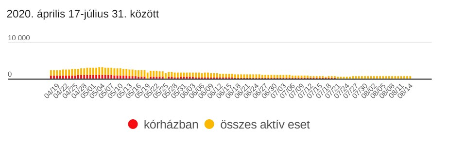
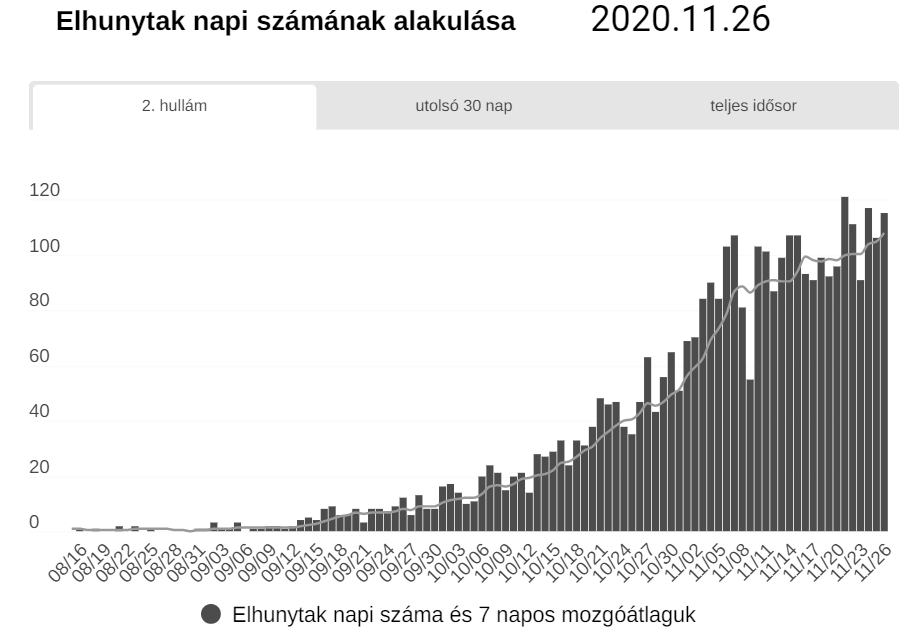

---
authors:
- Presinszky Judit
categories:
- Telex
title: "Kicsit enyhült a járvány felfutása, de még korai lenne hátradőlni "
date: "2020-11-26"
---
Több mint két hét telt el azóta, hogy november 9-én a kormány az eddigi
legkeményebb koronavírus-korlátozásokat vezette be Magyarországon. Életbe lépett az
éjszakai kijárási tilalom, betiltottak minden gyülekezést, nem lehet éttermekben enni,
nincs mozi és színház, focimeccseket sem lehet nézni, a középiskolák és egyetemek
átálltak online oktatásra.

A korlátozó intézkedésekkel a társadalmi érintkezések számának csökkentésétől a
szakemberek azt várták és várják, hogy kevesebb legyen az új fertőzött, és így
kevesebb beteg kerüljön kórházba. Merkely Béla a Semmelweis Egyetem rektora a
bevezetések után azt mondta: reményeik szerint ezekkel 60 százalékkal mérsékelik a
kontaktusokat, és ezzel lassítják a vírus terjedését. Mint korábban írtuk, a korlátozások
először két-három hét múlva hozhatnak valamiféle eredményt, úgyhogy megnéztük,
hogy állunk 16 nappal a szigorítások bevezetése után.

Előbb arra lehetett számítani, hogy a napi új fertőzések száma kezdhet el csökkenni,
mivel a tünetek általában 5-10-14 nap alatt fejlődnek ki a fertőzötteknél. A Telex
grafikonján láthatja, hogy néhány kiugrástól eltekintve stagnált vagy csökkent az új
fertőzöttek száma. (A grafikonon kiválaszthatja, hogy a teljes idősorra, a második hullám
alakulására, vagy az aktuális trendekre kíváncsi).

Müller Cecília országos tisztifőorvos egyelőre óvatos. A keddi operatív törzs
tájékoztatóján azt mondta, még mindig nem látni a járvány tetőzését. A szerdai
tájékoztatón viszont már arról beszélt, hogy a 47. héten 7 százalékkal kevesebb pozitív
személyt regisztráltak Magyarországon, mint egy héttel korábban.

Az Átlátszó Koronamonitorján az is látható, hogy az aktív fertőzöttek száma ugyan nő, a
növekedési ütem azonban lassul. Ezt a mutatót úgy kapjuk meg, ha az elmúlt hét nap
átlagát elosztjuk az azt megelőző hét nap átlagával. Ameddig a hányados 1 felett van,
addig még növekedés tapasztalható. Ez a mutató jelenleg elég közel van az 1-hez.

Az egészségügy teherbírása szempontjából fontos, hogy egy adott pillanatban a kórházban fekvők közül hányan vannak lélegeztetőgépen, és ez hogy alakult az elmúlt hetekben. Az elmúlt napokban a kórházban ápoltak számában is mutatkozott némi csökkenés, de a számok ismét emelkedtek. Erről Müller kedden azt mondta, "ezek a számok nehezen csökkennek, enyhén emelkedő tendenciát mutatnak, de talán már nem exponenciális mértékben”.

A halálozások számának csökkenése jóval későbbre várható, mivel a halálos kimenetel csak a tünetek megjelenése utáni hosszabb kórházi kezelés után, 4-5 hét múlva következik be. Ezek az adatok jelenleg stagnálnak vagy ugrálnak.

Az elmúlt időszakban ugyanakkor valamennyivel megnőtt a mintavételek száma, miután orvostanhallgatókat és egyetemi hallgatókat vont be az Országos Mentőszolgálat a tesztelésbe.

Szakértők szerint akkor lehet megbízható módon a tesztelések által kimutatott napi új esetszámra hagyatkozni, ha az elvégzett tesztek pozitivitási aránya nem haladja meg az 5 százalékot. Mozgóátlagban látszik némi javulás a tesztpozitivásban, de az 5 százaléknak november végén még most is négy-ötszörösénél járunk:

A gyógyultak napi száma alapjáraton növekvő tendenciát mutat, de mégis eléggé hullámzik.

Az országos tisztifőorvos kedden azt is mondta, a kormány szerdán dönt a további szigorításról vagy enyhítésről. Kövér László, az Országgyűlés elnöke pedig azt mondta osztrák kollégájának egy videómegbeszélésen, hogy az ünnepekig nem tervez újabb szigorításokat a magyar kormány, ami inkább a már meghozott korlátozó intézkedések pontos betartását célozza meg az intézkedéseivel.
