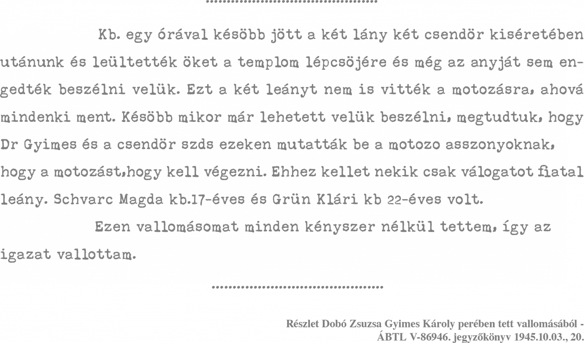
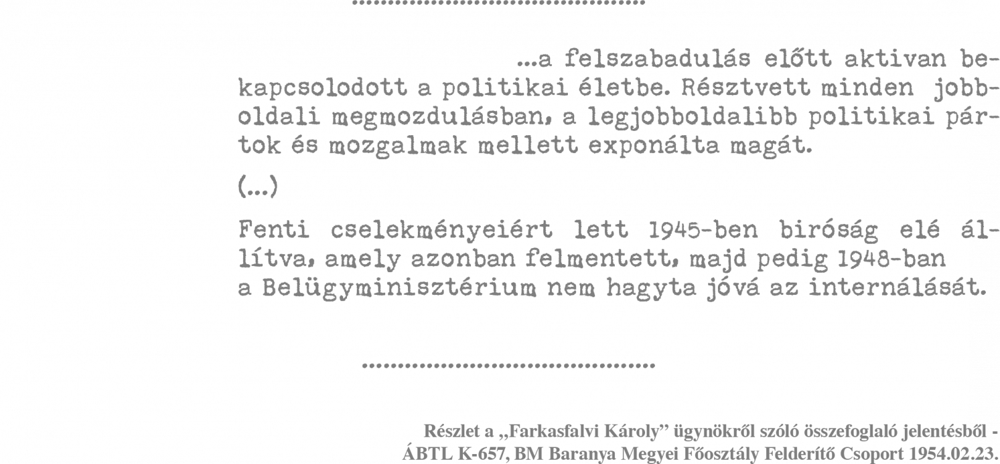
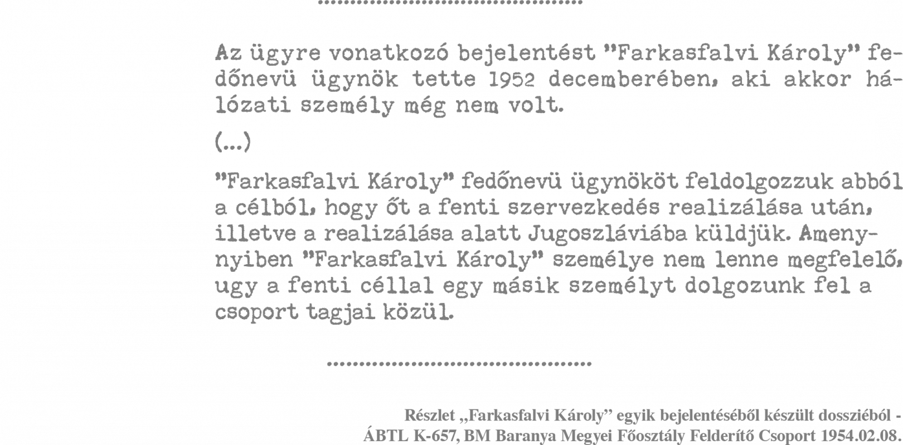
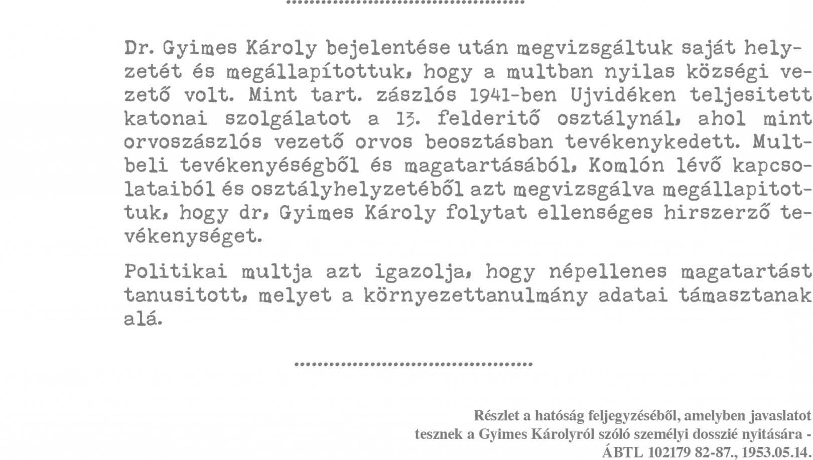

---
authors:
- Ungváry Krisztián
categories:
- Telex
title: ""
date: "2020-02-03"
---

> https://telex.hu/komplex/2024/01/29/bayer-zsolt-nagyapja-gyimes-karoly-nyilas-besugo
>  KOMPLEX BELFÖLD Legfontosabb 2024. január 29.  07:00

A vele egyet nem értők szüleiről és nagyszüleiről előszeretettel író Bayer Zsolt többször írt már a saját anyai nagyapjáról is  de nem a valóságot. Márpedig, ha Bayer szerint „csak meghatározza az emberfiát a családja”, érdemes lehet azon is elgondolkodni, mennyiben határozta meg Bayer Zsoltot anyai nagyapja, a testüregmotozó kiskőrösi nyilasból lett kommunista besúgó. Azzal az állítással ugyanis, amely szerint az emberre jelentős hatással van családi környezete, e sorok írója is egyetért.

Bayer Zsolt rendszeresen fel szokta emlegetni politikai ellenfelei szüleinek és nagyszüleinek valós vagy vélt viselt dolgait. Részesült ebben a kitüntetésben Bauer Tamás, Donáth Anna, Fekete-Győr András, Rényi Pál Dániel, Dobrev Klára és még ki tudja, ki. Bayer meg is indokolta, hogy miért tartja a (nagy)apák és fiúk témakört fontosnak. „Önmagában természetesen semmit sem jelent, hogy ki az apja valakinek, de ha nem következik be hamar a nyílt és látványos lázadás, akkor azért csak meghatározza az emberfiát a családja. Így határozta meg szerinte Bauer Tamást az apja, a »körmös Bauer«1, a keményvonalas kommunisták egyik legszadistább kihallgatótisztje.”2 2023. február 6-án nemes egyszerűséggel Az unokák címmel írt cikket arról, hogy Donáth Anna, illetve Dobrev Klára lényegében „ugyanaz”, mint nagyszüleik.

Vizsgáljuk meg akkor Bayer Zsolt anyai nagyapját, Gyimes Károlyt, akit szerzőnk a keresztény középosztály prototípusának tart: „vidéki körorvos, amilyen csak a regényekben van. Szivarfüst, jó ebéd, bor meg savanyú víz, gonddal kötött nyakkendő, tekintély, boldog békeidők. Úgy képzelem, összenézett olykor bűnösen a cselédlánnyal, és mosolygok olyankor, nem is tudom, miért…”5

2004-ben Tamás Gáspár Miklós egy cikke Bayer Zsoltot önvallomásra ingerelte. TGM írása szerint: „Az újfasiszta fiatalok a rendszerváltás árvái. A mi szerencsétlen gyermekeink. Ők az új polgári középosztály elkószált, borzas, aranyos kölykei.”3

Bayer válasza tagadó volt: „Nem. Sok-sok nem. Mert mindjárt és mindenekfelett: nincsen új polgári középosztály. Hogy miért? Mert legelőbb a perzsaszőnyegeket és a festményeket vitték el édesanyáméktól. Azzal rendezték be a kiskőrösi pártházat. Aztán elvették a házat. Végül pedig elvitték nagyapámat. Akik a perzsaszőnyegek és a festmények elrablásával kezdik, a nagyapák elvitelével végzik.”4 Bayer szerint a választóvonal nem zsidók és nemzsidók, hanem a polgári középosztály és a lumpenprolik között húzódik. Ezt azzal illusztrálja, hogy a családja régiségeit az 1950-es években megvásárló „zsidó handlét” (aki nála szintén a középosztályhoz tartozik) a „régi polgári középosztály mentette” a vészkorszakban. „Nyilasnak meg a lumpenproli ment, aki aztán átöltözött ávósnak. Az az oly sokat emlegetett »kis ország, egy csőcselék«  na, az mind rohadt lumpenproli. Nem munkás: lumpenproli. Hagyomány, érték, műveltség, tartás nélkül. Itt a törésvonal, nem ott, ahol ez a velejéig rothadt, nagyon aljas és lenyűgözően ostoba kis értelmiségünk sejti vagy sejteti. Igen, a lumpenproli előbb nyilas volt, aztán ávós lett. Mások meg rossz pálinkát mértek a magyar parasztnak Kazárföldön, kifosztották uzsorakamattal, aztán beköltöztek nagypapa házába, és elmentek ávós őrnagynak meg III/III-as besúgónak. Mert tényleg összenő, ami összetartozik.”

Az idézet utolsó két mondata közötti van némi bakugrás, a „lumpenproli” ugyanis biztos nem mért pálinkát Kazárföldön, azaz Kárpátalján  amit Bayer ír, az csakis a falusi zsidó kereskedőkre vonatkoztatható, mint ahogyan az ezt követő állításokat is nehéz másképp dekódolni, mint antiszemita utalásokat  amiben a bayeri életmű egyébként is igen gazdag. A továbbiak magyarázni is fogják, hogy mi is az eredője ennek a magatartásnak.

# A kiskőrösi nyilas

Bayer nagyapja, Gyimes Károly, 1937-től Kiskőrösön volt magán-, majd körzeti orvos (apjának Budapesten volt fogorvosi praxisa). Egy évvel később a hungarista mozgalom egyik legfontosabb kiskőrösi szervezője lett, vezetőségi tag és járási propagandavezető pozíciót is kapott, sőt egy ideig a pártszervezet vezetőjeként működött. Felesége is belépett a nyilas pártba (ezért 1945-ben rövidebb ideig őt is rendőrhatósági felügyelet alá helyezték). Gyimes nevét a Magyarság 1938. október 2-i száma mint a kiskőrösi pártszervezet vezetőjét említette. Rendszeresen fizetett tagdíjat és a párt egyenruhájában is járt, de 1942 körül átlépett egy másik szélsőjobboldali szervezetbe, a Magyar Megújulás Pártjába. A háború után, a népbíróság előtt arra hivatkozott, hogy a nyilas pártból már 1940-ben kilépett, ez azonban egyáltalán nem biztos, hogy igaz. Gyimes apósa, Solti János is nyilas volt, amit az is jellemez, hogy még 1944-ben is nyilas ingben járt (1945-ben internálták). Azt, hogy nyilasként aktív politikai életet élt, legalább öt különböző tanú igazolta a későbbiekben.

Mindehhez képest Bayer erről sokáig semmit sem akart tudni, majd egy 2016-os cikkben annyit ismert el, hogy nagyapja 1944-ben lépett be a nyilas pártba. Ez részéről nyilvánvaló hazugság, ugyanis ugyanebben a cikkben azt is elárulja, hogy ismeri az ezzel kapcsolatos dokumentumok egy részét.

Gyimes 1940-től szinte folyamatosan katonai szolgálatot teljesített. 1942 telén állomáshelye Újvidéken volt, azonban arra nincsen adat, hogy az ottani tömeggyilkosságokban részt vett volna. Mivel tartalékos tiszti személyi okmánygyűjtője nem lelhető fel, ezért szolgálati viszonyai is csak töredékesen rekonstruálhatók. Annyi biztos, hogy 1945. március 21-én Esztergomnál, mint a 13. egészségügyi oszlop egyik beosztottja, szovjet fogságba esett, de innen már 1945 szeptemberében elengedték.

Gyimes ellen Kiskőrösön az elsők között indult vizsgálat. Bíró Antal, a politikai rendőrség helyi vezetője 1945. április 24-én állította össze a leginkább kompromittált személyek névsorát. A letartóztatandó hét személy egyike Gyimes volt.7 Közben a kommunista párt kiskőrösi szervezete Gyimes lakását 1945. június 19-én lefoglalta8, azonban Gyimes ott tartózkodó anyósának megengedték, hogy a lakás berendezésének egy részét elvigye, az ott maradt tárgyakról pedig Davidovics Jakab, a politikai rendőrség helyi vezetője leltárt vett fel.9 A legértékesebbnek tartott hét perzsaszőnyeget Pesti (Bayer kedvéért előző nevét is megadom: Grünbaum) László járási párttitkár elismervény ellenében saját lakására vitte. A lakás lefoglalása miatt Gyimesné panasszal élt, emiatt Tömpe András rendőr ezredes osztályvezető igazoló jelentést írt a belügyminiszternek. Arról, hogy a perzsaszőnyegekkel mi történt, nincs adat.

Gyimes kiskőrösi hazaérkezése után nem sokkal megszülettek az első vele kapcsolatos jegyzőkönyvek is. Érdekes ezek időbeli egybeesése, mert mindegyik 1945. szeptember 24-én kelt. Nehéz elhessegetni a gyanút, hogy Gyimes eleve úgy érkezett meg Kiskőrösre, hogy tudta: vaj van a fején és ezért első dolga volt két ismerősének, Nagy Ferenc hadnagynak és Miller Imre tartalékos zászlósnak a tanúvallomását jegyzőkönyveztetni Kiskőrösön a rendőrségen  az is lehet, hogy biztos, ami biztos, velük is érkezett meg. Az érintettek Davidovics előtt tanúskodtak Gyimes mellett. Állításuk szerint Gyimes Milleren keresztül a Keleti Jövő Csoport tagja volt és részt vett a Budapest Vizafogó állomás megmentésében azzal, hogy Hankóczi Imre állomásfőnököt rávették arra, hogy az állomást ne robbantsa fel, sőt Hankóczi a németek által küldött lőszerek továbbítását is szabotálta. Fentiekre hivatkozva kérték, hogy Gyimes szabadlábon védekezhessen.10

Felületes szemlélő könnyűszerrel hitelt adhat ennek a dokumentumnak, annál is inkább, mert az egyik aláírója, Nagy Ferenc hadnagy tényleg a Keleti Jövő Csoport tagja volt. Kettejük 1948 után keletkezett önéletrajzai azonban nyilvánvalóvá teszik, hogy a dokumentum valójában fikció  nem beszélve arról, hogy az abban előadott történet kronológiailag sem stimmelhet. Nagy és Miller is tovább szolgált a „demokratikus” honvédségben, illetve a néphadseregben. A Rákosi-rendszerben mindketten rá voltak kényszerítve arra, hogy részletes önéletrajzokban ismertessék múltbeli cselekedeteiket. Mivel „horthysta” múlttal rendelkeztek, elemi érdekük volt minden tényleges ellenállási cselekmény részletes dokumentálása. Erről az akcióról azonban egyikük sem írt egy sort sem.11 Sőt Miller saját ellenállási tevékenységéről sem írt, holott ez akkor talán az egyik legfontosabb kérdés volt, amit egy önéletrajzba be kellett volna írnia. Nyilván azért járt el így, mert pontosan tudta, hogy óriási kockázatot jelentett volna a valótlan adatok szerepeltetése. Az ügyről csak a következőket tartotta fontosnak közölni: „1944-ben Nagy Ferenc hadnaggyal ismerkedett meg az [I. hadtest karhatalmi] zászlóalj tartalékos tisztikara és ki akarta építeni a kapcsolatot Bajcsy-Zsilinszkyvel, de [Nagy] fecsegése miatt az egész tisztikart lefogták [a nyilasok], köztük engem is, és 8 napig tartottak zárva közüzemek és hidak felrobbantásának megakadályozására szervezkedés miatt.”12 Nagyot és huszonhárom társát 1944. november 23-án állították bíróság elé, azonban nyolc nap elteltével, miután jóakaróik a terhelő iratokat meghamisították, mindannyian szabadlábra kerültek  de ettől fogva már semmilyen, Gyimessel kapcsolatba hozható ellenállási cselekményben nem vettek részt. Azt, hogy Gyimesnek az ügyhöz nem sok köze volt, leginkább az illusztrálja, hogy le se tartóztatták. Miller és Gyimes a Vizafogó állomás megmentésében azért sem vehetett részt, mert Millert november végén a teljes hadtest karhatalmi zászlóaljjal Csepelre vezényelték. A Vizafogó állomás viszont a XIII. kerületben volt, és felrobbantását nem tervezhették 1944. december vége előtt (a szovjet csapatok 1945. január 14. után érték el az állomást). Azt, hogy Gyimes ebben az időszakban hol tartózkodott, nem tudni, de biztos, hogy december 24. után már nem volt Budapesten.

Ugyanaznap készült Gyimes első kihallgatási jegyzőkönyve is, amelyben elismerte, hogy nyilas volt, de arra hivatkozott, hogy nem volt aktív, és 1940 karácsonyán a pártból kilépett. Gettóorvosi szerepéről azt állította, hogy erre a zsidó tanács kérte fel, egy vizsgálatért csak 5 pengőt kért.

A kiskőrösi gettóban történt hüvelyi motozás kapcsán azt mondta, hogy „szólt nekem Finta [Imre]13 csendőr százados, hogy mint orvos vegyek részt a gettó lakóinak megmotozásában, amit el is vállaltam. A vizsgálatban nem vettem aktívan részt, csak mint orvos az ellenőrzés lett volna a dolgom, de ezt sem láttam el úgy, ahogy kellett volna. Kint tartózkodtam, és csak néha mentem be.”14

Az érintettek azonban erre teljesen másképp emlékeztek.

Fleischer Miklósné szerint Gyimes „a betegekkel lelkiismeretlenül viselkedett, amikor valahonnan hívtuk beteghez, csak órák múlva jött be”. Azokat, akik segítséget kértek tőle, vagy kinevette, vagy elfogadott tőlük pénzt, de nem csinált semmit. „Kinn a vasútnál a súlyos haldokló betegek kinn feküdtek az esőben a földön, akik között volt egy orvos, aki öngyilkos lett. Haldoklott és én kértem Gyimest, hogy doktor úr, legalább ezt az egyet hagyja itthon hiszen csak percei vannak hátra. Gyimes csak mosolygott, és intett a fejével, hogy nem lehet itt tartani.”15 Heisler Anna tanúvallomásában arra emlékezett, hogy Gyimes a deportálások előtt azt mondta nekik, „nem szégyellik magukat, gyáva zsidók, miért vannak úgy megijedve azért, hogy el kell menni egy kicsit. Tudom, hogy óriási pénzösszegeket fogadott el a zsidóktól, az én nővérem adott neki 500 pengőt, azért hogy a súlyos betegekkel és haldoklókkal várjanak egy-két napot hogy itthon maradhassanak vagy itthon hajlanak meg. Gyimes a pénzt elfogadta, ennek ellenére nem tartotta vissza a súlyos betegeket. Sőt, a betegek között volt egy zsidó orvos, aki öngyilkos lett és haldoklott, amikor a bevagonírozásra került sor. Fülöpszállás és Kiskőrös között az úton meg is halt. Fleischer Miklósné Hetényi Manci kérte az állomáson Gyimest, hogy ne rakja be az élők közé a haldokló embert. Ő csak nevetett és nem szólt semmit. Egész idő alatt, amíg a gettóban volt, látszott rajta, hogy örömét leli abban, hogy látja ezt a sok szerencsétlen embert és azoknak szenvedését.”16

Két tanú is volt arra, hogy Gyimes segítség ígéretével pénzt fogadott el, de semmit sem tett, és három tanú is igazolta azt, hogy a nők hüvelyi motozásában személyesen is részt vett. Dobó Zsuzsa vallomása szerint „két fiatal lányon, Schwarz Magdán és Grün Klárán mutatta be Gyimes és Finta hogy hogyan kell motozni a motozóasszonyoknak”.17 Dobó kiemelte vallomásában, hogy Gyimes és Finta szándékosan a legfiatalabb és legcsinosabb lányokat válogatta ki erre a feladatra.

A deportáltak hüvelyi motozása bátran nevezhető a holokauszt történetében hungarikumnak, ugyanis ilyesmire ismereteim szerint kizárólag Magyarországon került sor, viszont Magyarországon belül az összes gettóban végrehajtották ezt annak dacára, hogy máig nem került elő olyan belügyminisztériumi utasítás, amely kifejezetten tartalmazta volna azt, hogy a deportáltakat testüregi motozásnak is alá kell vetni. Ez a beavatkozás jól tükrözte a magyar állam álláspontját az érintettek jogi státusáról, pontosabban annak teljes jogfosztottságáról. 14 éves kortól ez az intézkedés mindenkire vonatkozott. A hüvelyi motozást a nyilvánosság előtt hajtották végre, a motozónők gumikesztyűit a folyamat során nem fertőtlenítették, és szűz lányokat is alávetettek ennek a borzalmas eljárásnak. Ki kell emelni, hogy a hüvelyi motozásban nem volt kötelező a részvétel, a gettó orvosait soha nem a gettó lakói kérték fel, hanem a helyi közigazgatási vezető jelölte ki, aki azonban nem kívánt részt venni ebben a folyamatban, az az ilyenfajta kijelöléseket minden további nélkül vissza tudta utasítani.

Mindehhez képest a kihallgatásokat nem követte Gyimes azonnali letartóztatása. Sőt Gyimes 1945 novembere és 1946 augusztusa között a Budapesti Közmunka Szolgálat vezető orvosa lehetett. Közben a kalocsai népügyészség kezdeményezésére körözést adtak ki ellene. Szerepet játszhatott ebben Gyimes óvatlansága is, ugyanis jelentkezett mentő tanúnak Gyenes István kiskőrösi főszolgabíró népbírósági perében.18 Az teljesen érthetetlen, hogy miért engedték egyáltalán szabadon, és az is furcsa, hogy a kihallgatásokat nem követte azonnal egy vádirat megszerkesztése és a tárgyalás. A rendőrség „Vezérőrnagy elvtárs” címzéssel ismeretlen időpontban egy név nélküli feljelentő levelet is kapott (ezek szerint a levél magának Péter Gábornak szólhatott). A feladó magát mint a „Magyarországi zsidók egyik önvédelmi szervezetének titkos megfigyelője” nevezte meg, és felhívta a hatóság figyelmét arra, hogy Gyimes Budapesten, a Bakáts tér 3. szám alatti házban bujkál.19

Minden bizonnyal ennek hatására 1946. június 28-án éjfél előtt nem sokkal a letartóztatását is megkísérelték, de Gyimes szagot kaphatott, mert budapesti lakásáról elmenekült. Új lakhelye a Tolna megyei Kaposszekcsőn volt, ahol orvosként praktizált. Körözését 1946. december 4-én visszavonták.20

# A balul sikerült felelősségre vonás

Ügyét végül a kalocsai népbíróság 1947. február 26-án tárgyalta, miután 1947. január 13-án a kalocsai népügyészségen megszületett az ellene szerkesztett vádirat. Ez rendkívül slendrián munka volt, mert még azokat a tanúvallomásokat sem használta fel teljes körben, amelyek már az 1945-ben indított eljárásban születtek. Így nem tették a vád tárgyává azt, hogy Gyimes a testi motozások betanítója volt, valamint azt sem, hogy pénzt szedett áldozataitól, akiket becsapott. Az aznap meghozott ítéletben Gyimest felmentették, az ügyész fellebbezést jelentett be ugyan, de azt később visszavonta. A felmentő ítélet elismerte ugyan, hogy Gyimes 1938 nyarától 1940 februárjáig nyilas aktivista volt, azonban mentő körülményként értékelte, hogy „sokat dolgozott a szegény emberekkel és szoros kapcsolatban volt az egyszerű néppel”. Erre vonatkozó iratok azonban Gyimes népbírósági anyagában nem találhatók  sokkal inkább arról van itt szó, hogy a kalocsai népbíróság szándékosan bagatellizálta az ügyet. Erre utal a Dél-Pestmegye című újság 1946. nyári cikke is, amely A kalocsai népbíróság a fasiszta csirkefogók menedékhelye címmel arról tudósított, hogy Gyimes rövid internálása alatt a bírósági irodán dolgozhatott, minden iratba betekinthetett, és a bíróságon a dolgozók csak „Karcsikám”-nak szólították.21 A népbíróság ítélete a gettóorvosi tevékenységet is azzal intézte el, hogy az a zsidó tanács felkérésére történt. Ezzel kapcsolatban egyetlen tanút sem hallgattak meg, sőt nem használták a már 1945-ben felvett tanúvallomásokat sem.22

1948 júniusában beidézték a Kaposszekcsőhöz legközelebbi államvédelmi hatósághoz (ami Sásd nagyközségben volt), de elengedték. Ezt követően eltűnt Kaposszekcsőről, és újra Budapesten húzta meg magát. 1948. július 11-én internálták, de már 1948. október 13-án szabadlábra helyezték, 1948. december 3-ig pedig rendőrhatósági felügyelet alatt tartották. Unokája, Bayer Zsolt állításával ellentétben nincsen adat arra, hogy az Andrássy út 60.-ba vitték volna (internáltakkal itt amúgy sem foglalkoztak).23

Minden jel arra mutat, hogy a felmentő népbírósági ítélet dacára továbbra is folyt Gyimes ellen az adatgyűjtés, illetve a meglévő terhelő adatok alapján minden bizonnyal internálni kívánták. Másrészt viszont Gyimes is megpróbált igazolást szerezni munkája végzéséhez, az Orvos Egészségügyi Szakszervezet főtitkára, Weil Emil, 1949. május 24-én biztos, ami biztos, jelentette is az ÁVH-nak, hogy Gyimes kérelmet adott be a szakszervezethez.24 1950. szeptember 13-án Károlyi Márton áv. alezredes az I. kerületi rendőrkapitányságot arról tájékoztatta, hogy Gyimes továbbra is körözés alatt van.25

Ehhez képest mégsem tartóztatták le, sőt 1950. október 1-jén áthelyezték a közeli Komlóra, ahol először körzeti orvosként, majd a tüdőbeteg intézet vezető orvosaként dolgozott.

# Az önkéntes besúgó

Történt, hogy az Elszámolási Vállalat tisztviselőjeként dolgozó Karácsony Jenőné ellen 1952. december 17-én nyomozást indított az ÁVH. A vele szemben megfogalmazott gyanú szerint Karácsony Jenőné egy 19 fős fegyveres összeesküvő csoport vezetője volt. A csoport tagjai a komlói bányaüzemnél és más vállalatoknál voltak alkalmazásban, és a gyanú szerint a jugoszláv titkosszolgálat, azaz az UDB felügyelete alatt, de valójában az angol MI5 irányításával dolgoztak.

Az ügyben keletkezett dokumentumok  elsősorban Karácsonyné előélete  már eleve gyanút kellett volna hogy ébresszenek a vádakat illetően. Karácsonyné ugyanis már korábban rendszeresen követett el szélhámosságokat, több személytől kölcsönöket vett fel és barátnőivel rendszeresen szellemidézést és hipnotizálást is folytatott. Mint később kiderült, az egész összeesküvés is csak Karácsonyné fantáziájának terméke volt.

A Karácsony Jenőné és Gyimes közti kapcsolat az után vált szorossá, hogy Gyimes felesége elhunyt. Egy alkalommal Gyimes anyagi helyzetéről panaszkodott Karácsonynénak, aki 5-10 ezer forint kölcsönt ajánlott fel. Az ajánlatra Gyimes igencsak meglepődhetett  tegyük hozzá, teljes joggal, mert ez abban az időben legalább háromhat havi fizetésnek felelt meg, viszont Karácsonyné igen rossz anyagi körülmények között élt egyébként. Gyimes azt kérdezte tőle, hogy „mondd, kinek dolgozol?”, amire Karácsonyné azt felelte, hogy „Titón keresztül az USA-nak”. Gyimes megkérdezte, hogy miért bízik meg benne, amire Karácsonyné azt felelte, hogy ismeri Gyimes korábbi kiskőrösi és budapesti dolgait (amelyeket nem részletezett) és ezért megbízik benne. Egyúttal egy pontosabban nem részletezett illegális akció lebonyolításának elősegítésére kért tőle három nap táppénzre történő beutalást, amit Gyimes meg is adott. 1952. december 22-én és 23-án újra táppénzes beutalókat kért, immár barátai számára, de ezt Gyimes megtagadta. Egyúttal december 21-én felkereste az ÁVH komlói kirendeltségét, és feljelentette Karácsonynét.26 Az ÁVH azonban nem akart foglalkozni vele, mert provokátornak tartotta  tudták ugyanis, hogy korábban szélsőjobboldali mozgalmár, tartalékos zászlós, valamint gettóorvos volt. Mindezek miatt önkéntes jelentkezése után személyi dossziét is nyitottak rá, de hálózattal nem ellenőrizték. Csupán annyit mondtak neki, hogy Karácsonynéval minden kapcsolatot szakítson meg.

1953 nyarán azonban az ÁVH visszatért az ügyre. Mivel Gyimes ekkor is készségesnek mutatkozott, „Farkasfalvi Károly” fedőnéven beszervezték, és ráállították Karácsonynéra, akivel újra felvette a kapcsolatot. A beszervezési folyamat formális része elhúzódott, egy 1953. december 12-én kelt jelentés szerint az ezzel kapcsolatos terveket már három hónapja elkészítették és jóváhagyásra felterjesztették, de ez még mindig nem érkezett meg. Fehér István ÁVH-százados végül december 20-ra tervezte a formális beszervezés végrehajtását.

A beszervezési folyamat részletei Gyimes B dossziéjának hiányában nem ismeretesek. Más iratokból azonban tudjuk, hogy formálisan pressziós alapon szervezték be, és a presszió alapjának múltbeli tevékenysége mellett a Karácsonynéval való kapcsolatát is feltüntették. Mindemellett a beszervezés barátságos körülmények között történhetett, mert Gyimes azzal kezdte, hogy „mindenben a legkészségesebben áll a Hatóság rendelkezésére”.27 Egy elejtett megjegyzésből azt is tudni, hogy az ÁVH tisztában volt Gyimes züllött magánéletével, ugyanis házasemberként több nővel intim kapcsolatot tartott fenn. Nincsen azonban adat arra, hogy ezt a körülményt kijátszották volna vele szemben.”.28

Fontos leszögezni, hogy Gyimes besúgása nem volt tét nélküli. Amennyiben Karácsonyné tevékenységének csak a fele igaz lett volna, akkor egészen biztosan halálos ítélettel sújtotta volna őt a bíróság. Így teljesen hamis Bayer összes ezzel kapcsolatos állítása: a nagyapját nem zsarolással szervezték be, nem a III/III szervezte be, és jelentései igenis ártottak másoknak.

Gyimes foglalkoztatása azonban „mezítlábas” módon már 1953 nyara óta zajlott. Annak érdekében, hogy még jobban Karácsonyné bizalmába férkőzzön, most ő adott kölcsön pénzt neki, az ehhez szükséges 300 forintot az ÁVH-tól kapta. Erre azért volt Karácsonynénak szüksége, mert munkahelyén 7 ezer forintot elsikkasztott és ezt kellett kipótolnia ideiglenes kölcsönökkel. Karácsonyné továbbra is tényként adta elő, hogy egy szervezkedést vezet, és 1953 októberében már arra is ígéretet tett Gyimesnek, hogy őt is beszervezi. Gyimes javaslatára megszervezték a Karácsonynéval folytatott és szervezkedést tárgyaló beszélgetései lehallgatását is. Gyimes azonban nem tudott titkot tartani, és „Varságy János” informátornak 1954 januárjában elfecsegte, hogy az ÁVH-nál feljelentette Karácsonynét.

1954 februárjában az ÁVH már azt tervezte, hogy Gyimest Jugoszláviába dobja át, amennyiben sikerül neki mélyebben beépülnie a szervezkedésbe. Emellett Gyimes lakására operatív technikát akartak beszerelni, hogy a Karácsonynéval folytatott beszélgetéseit rögzíteni tudják, és „Váradi Gyula” fedőnéven beszervezték egy barátját is. Végül Karácsony Jenőnét letartóztatták, és 1955-ben két év börtönbüntetésre ítélték  a semmiért. Szervezkedései ugyanis kivétel nélkül a fantázia termékei voltak.

Mivel Gyimes, azaz fedőnevén „Farkasfalvi Károly” B és M dossziéja nem lelhető fel (feltehetően a forradalom alatt mindkettő megsemmisült), ezért hálózati tevékenységét a Karácsonyné-féle ügyet leszámítva egészen 1957-ig nem ismerjük. Első ismert jelentését 1957. november 17-én adta le, és ebben szemrehányásokat tett tartóinak azért, mert a konspiratív találkozóikat rosszul szervezik, sőt egy ismerőse, Schock Márton, a „Muci” zenekar vezetője, 1956. október végén egy gépelt papírt is adott neki, amely az ÁVH komlói kirendeltségén keletkezett és amelyen Gyimes is szerepelt  magyarán tartani kellett attól, hogy a nyilvánosság előtt dekonspirálódott. Két nappal később egy írásos jelentésében Zengő Zoltán ÁVH-hadnagyot áztatta el, mert megírta róla, hogy egy mulatóhelyiségben szórakozva másnak fizette a számláját, és ebből az ott lévők arra következtettek, hogy az érintett Zengő ügynöke. A jelentésre a tartótiszt főnöke írással fel is jegyezte, hogy „lehet tanulni a jelentésből a tartást illetően!”.29 Ezt követően is rendszeresen találkozott tartójával, de érdektelen jelentéseket adott, és ezért tartói elégedetlenek voltak vele.

Gyimest alapvetően három irányba foglalkoztatták: a disszidens Horváth Géza (mecseki fegyveres felkelő) családjára, valamint Oswald János komlói káplánra és Thurzó István jezsuita szerzetesre is ráállították. Utóbbiról azt jelentette, hogy szereti az alkoholt és a nőket, valamint pertuviszonyban van a helyi rendőrökkel, akikkel a templom mögötti egyik szobában annyira berúgtak, hogy a rendőrök pisztolyukkal összevissza lövöldöztek a falra. Tartója rendszeresen írásban is eligazította, és ezeket az eligazításokat Gyimes fedőnevén aláírta. Képességeit tartói igen sokra értékelték, és amikor feltűnt, hogy egy jelentésében nem volt őszinte, 1959 októberében elhatározták az átszervezését. Ezt a tartótiszt a „megerősítés” jelzővel írta körül. Erre végül csak 1960. november 29-én került sor. Addigra ugyanis a tartójánál is betelt a pohár, mert Gyimes több találkozóra nem jött el (19591960 között összesen „csak” 46 jelentést adott  ami egyébként messze átlag feletti teljesítménynek mondható). Kerek perec megzsarolták azzal, hogy amennyiben nem hajlandó az aktívabb együttműködésre, akkor megvonják tőle az erkölcsi bizonyítványt és ennek hiányában nem fogja tudni betölteni orvosi állását. A „megerősítés” azonban nem volt teljesen sikeres, és ezért 1961. január 20-án újabb foglalkoztatási tervet készítettek számára. Új fedőneve „Boros József” lett  ezen a néven első jelentését 1961. március 18-án könyvelték le (magát a jelentést január 10-én adta). Az állambiztonság zokon vette, hogy rákérdezés dacára elhallgatta intim nőügyeit, de ennél is súlyosabban esett latba az a bűnügy, amelybe belekeveredett, és amelynek következtében egy év felfüggesztett börtön- és 5 ezer forint pénzbüntetésre ítélték. Az ügyről a tartó csak „Bányai féle gyerekelcsinálási dolog”-ként tett említést. Bányai József ügyében 1960. január 22-én hirdettek ítéletet. Bányai négy évet, két bűntársa egy évet, illetve tíz hónapot kapott, mert összecserélte a betegek gyógyszereit és emiatt egy személy meg is halt. Azt, hogy Gyimes és Bányai között miért tételezett fel szoros kapcsolatot az állambiztonság, a rendelkezésre álló forrásokból nem lehet megállapítani. Gyimest mindenesetre Bányaitól elkülönített eljárásban ítélték el, „két rendbeli nyereségvágyból [elkövetett magzatelhajtás] és egy rendbeli magzatelhajtás bűntette miatt, mint felbujtó”.30

Gyimes magzatgyilkossági tevékenysége kapcsán meg kell említeni, hogy Magyarországon 1956-tól az abortuszt legalizálták, de kérelemhez és egy bizottság előtti megjelenéshez kötötték, az eljárást pedig 19731988 között szigorították. A visszautasított abortuszkérelmek arányát még nem tárta fel a kutatás, sporadikus adatok szerint ebben az időben 2 százalék körüli érték lehetett.

Az ügyben tehát 1960 márciusában született bírósági ítélet, de emiatt Gyimest csak egy évvel később függesztették fel állásából. Mindez egyúttal adalék a Kádár-rendszer slamposságára is. Gyimes ugyanis mindent megúszott volna, ha dr. Halus komlói városi főorvos nem bolygatja meg az ügyet. Mayer János tanácselnök-helyettes viszont Gyimest mindenképp foglalkoztatni kívánta, és csak annyit mondott neki, hogy oldja meg az erkölcsi bizonyítvány kérdését és akkor, ha az tiszta, „az ügy el van intézve”. Ez egyben arra is utal, hogy Mayer tudhatott Gyimes belügyi kapcsolatairól. Tartója tanácsára Gyimes beadta a hatósági erkölcsi bizonyítvány iránti kérelmét, de mivel korábbi munkája nem volt kellően magas színvonalú, ezért a BM nem intézte el neki. Így Gyimes lakhelyváltoztatásra kényszerült. Nagykanizsára költözve azonban minden további nélkül dolgozhatott tovább mint orvos. Erkölcsi bizonyítványt sem kértek tőle.

Emellett besúgói tevékenysége sem szakadt meg. Erről két irattározott munkadosszié is tanúskodik, ami annyit jelent, hogy legalább 3400 oldal gyűlt össze foglalkoztatása során a jelentéseiből (egy munkadossziét akkor irattároztak, ha a dosszié nagyjából ezt a mennyiségű oldalszámot érte el). „Boros József” két kötetét azonban a rendszerváltás előtt megsemmisítették.

Gyimes Károly 1973. február 14-én Nagykanizsán elhunyt.

# Bayer múltfeldolgozása

További következtetések levonására is alkalmas az, ahogyan az unoka előadja a nagyapja történetét. Annál is inkább, mert Bayer Zsolt saját bevallása szerint 2016 óta ismeri a nagyapjára vonatkozó állambiztonsági iratokat, tehát legalább azóta terjeszt róla valótlanságokat: azaz hazudik. Szerinte Gyimes a gettóban válogatás nélkül tömegesen mentette az embereket. Ennek igazolására egy volt gettórendőr  tehát egy olyan személy, aki munkaköréből adódóan valójában Gyimes bűntársa volt  levelét hozza fel, amelyben az érintett azt állította, hogy Gyimes nem vett semmilyen módon részt a hüvelyi motozásokban, és mindent megtett az öngyilkosságot elkövető zsidó orvos megmentéséért. A másik levél írója, Klein Györgyné, azt igazolta, hogy anyja a gettóból írt levelekben dicsérően emlékezett meg Gyimesről. Az említett levelek furcsasága, hogy Gyimes vizsgálati anyagában nem szerepelnek, a népbíróság felmentő ítélete sem említi őket. A gettórendőr tanúskodása nyilvánvaló hazugságokból állt, a másik levél pedig eleve csak áttételes információkat tartalmazott, amelyek nem alkalmasak Gyimes rosszindulatú viselkedésének cáfolatára.

Tanulságos elemezni azt, ahogyan Bayer a nagyszülei sorsát előadta: „Állt a szekér egy hajnalon, kint az öreg udvaron, rajta a minden, a minden tetején a nyolcéves anyám így indultak valahová. Nagyanyám hangosan szavalta Ábrányi Emil Haza című versét a zokogó anyámnak, a zsidó meg röhögött, a zsidó gyerekei is röhögtek. Az Andrássy út 60.-ban is röhögtek a zsidó ávósok, dokikámnak szólították a félholt Nagypapát, és mulattak a színes, békebeli nyakkendőjén.”31 Ez a szöveg azért érdekes, mert az elbeszélő tévedhetetlen pontossággal azonosítja be ellenségeit, úgy mintha közben mindegyik egy nagy Dávid-csillagot hordott volna a ruháján  miközben azok magukat biztos nem vallották zsidónak és 1948-ban egyébként már az ÁVH állományának nagyobb része nem volt zsidó. Ez a tévedhetetlen beazonosítás a későbbiekben is megjelenik és egyúttal Bayer már nem is palástolt antiszemitizmusának bizonyítéka.

A zsidó alapvetően három különféle dolgot jelenthet: vallást, nemzetiséget és származást. A bayeri „zsidók”-ra csak a legutóbbi vonatkoztatható, ami az ügy kontextusában nehezen minősíthető nem antiszemita megnyilvánulásnak, mivel az érintettek nemcsak hogy nem voltak sem zsidó vallásúak, sem zsidó nemzetiségűek, hanem nem is akartak tudni saját zsidóságukról  éppen azért lettek kommunisták, mert ebben egy emancipációs lehetőséget láttak. Mindettől függetlenül elvileg lenne és lehetne helye annak egy elbeszélésben, hogy az elbeszélés fő alakjai milyen származásúak  ez az írás is erről szól , azonban csak akkor, ha az elbeszélő arról is gondoskodik, hogy a származással kapcsolatos kontextusokat is bemutassa. Ez az, ami Bayernél vagy elmarad vagy annyira sérülten történik, hogy az a történelemhamisítás minősített esetének nevezhető. Jó példa erre elbeszélésének azon mozzanata, amely szerint családja arra kényszerült, hogy az 1950-es években eladja bútorait „a zsidó handlénak”, akit szerinte „nem mellesleg 1944-ben a »régi polgári középosztály mentett«” (vajon ezt honnan tudja?), és akinek ma jól menő régiségboltja van a Falk Miksa utcában, olyannyira, hogy most Bayer tőle vásárolja vissza a bútorokat. Amikor az „Amerikába szakadt, elüldözött osztálysorsosaim [sic!] leszármazottai megnyerik a magyar állam ellen indított pereiket, és leakasztgatják múzeumaink falairól régi családi festményeiket (azután, hogy egyszer már felvették értük a kártérítést), akkor visszakérem a festményeinket”.

Itt érdemes ismét megállni annak érdekében, hogy kibontsuk e gyönyörű költői kép minden szeletét.

Bayer tehát azon siránkozik, hogy neki és családjának máig nem jutott kárpótlás az elszenvedett sérelmekért, szemben a duplán kárpótolt zsidókkal. A „zsidók” valahogy mindig a napos oldalra kerülnek, míg szegény Bayer továbbra is kisemmizett marad. Szerencsére azt is megtudjuk, hogy ennek mi az oka. A zsidók „beépülnek és elkülönülnek egyszerre” olyannyira, hogy „míg a budapesti egyetemek tele vannak velük, addig a Lauder Javnéban lámpással sem lehet találni egy keresztényt. Ez a titok másik fele. Ez az alap.”

Érdeklődtem a Lauder Javne gimnáziumban, hogy mikor végzett Bayer Zsolt antropológiai kutatásokat a diákok között, de azt a feleletet kaptam, hogy az intézményben még nem látták. Azonban példája egyébként is rossz, mert a Lauder egy világi zsidó iskola, vagyis deklaráltan a magyar társadalom egy speciális csoportjára fókuszál. Kicsit hasonlóan, mint a szerzetesrendek által fenntartott gimnáziumok. Mindazonáltal sem a Lauderben, sem a Pannonhalmi Bencés Gimnáziumban nem vizsgálják a jelentkezők származását. Ami a felvételnél releváns, az a felvételiző (illetve 14 éves kor alatt a felvételiző családja) személyes kapcsolata a keresztény vallással vagy a zsidó kultúrával. Amennyiben Bayer saját hasonlatát komolyan venné, akkor arra kellene jutnia, hogy a Lauder egy befogadóbb intézmény, mint az egyházi iskolák, mivel diákjaitól semmilyen vallás tételes gyakorlását nem kéri számon. Ezért is nevezik „világi zsidó iskolának” és épp ezért járnak oda olyanok is, akik nem zsidó származásúak. Arról ne is beszéljünk, hogy bár a Lauder magángimnázium, de szociális alapon is felvesz diákokat épp azért, hogy ne csak a fizetőképes rétegek gyerekei járhassanak oda.

Mindezt összefoglalva, Bayer értelmezésében a „zsidó” olyan személy, aki nyerészkedik a holokauszton, saját fordított numerus clausust érvényesít, a zsidó prolik pedig ÁVH-s ivadékok. Ezek a kényszerképzetek nem különösebben újak és nem is eredetiek, 1920-ban, a numerus clausus vitájában is előjött az a tézis, hogy a zsidóság vízzáró rétegként zárja el a magyar társadalmon belüli egészséges áramlásokat, mert fordított numerus clausust érvényesít. Amennyiben pedig bárki elfelejtette volna ezt, azon segített Csurka István, aki az „apák és fiúk” összeesküvés-elmélettel aktualizálni is tudta a történetet. A „zsidó ávéhás” legendának azonban legalább van valamilyen racionális magja, mivel 1945-ben különböző okokból a politikai rendőrségen belül a zsidóság aránya valóban magasan felülreprezentált volt. A Bayer-féle összeesküvés-elméletnek azonban semmilyen racionális magja nincsen, azt leszámítva, hogy mintha saját felmenői bűneit vetítené ki az imaginárius „zsidó” alakjára, akit így elidegeníthet magától, és akit ezért már önfeledten gyűlölhet.

Bayer mentségére szól  és egyúttal némi reményt is nyújt a jövőt illetően , hogy hozzáállása nem volt mindig ilyen. Tündértemető című esszékötetének egy fejezete azt tárgyalja, hogy ő mint igazi proletár, hogyan nyerte meg az osztályharcot barátnője „burzsoá”  azaz polgári  családjával szemben. A történetből kiderül, hogy Bayer számára (akkor még) nemcsak az ezüst étkészlet újdonság, hanem a különféle méretű és célú evőeszközök is szokatlanok. Az pedig számára már-már kultúrbotrány, hogy az étkezés végén felszolgált gyümölcsöket késsel fogyasztják el. Étkezés közbeni és ezt követő viszontagságait most fedje jótékony homály  a lényeg annyi, hogy egy évvel később mindezt el tudta mondani vendéglátóinak, akik erre a „gyónására” a lehető legfesztelenebbül reagáltak. Van tehát az életműnek olyan mozzanata is, amelyik a maga módján hitelesnek mondható.

Bayer családtörténete nem mindennapi. Valójában mélyen szánni kellene őt, akinek nagyapja antiszemita nyilas és ÁVH-s besúgó. Nem csak ezen az ágon mutathatók ki ezek a traumák. Bayer, aki magát előszeretettel adja ki budai polgárnak, valójában egy igazi proletár házban nőtt fel  nem egy budai villában, hanem egy olyan épületben, amelynek lakói kétkezi munkások voltak. Egy olyan házban tehát, amely épp az ő logikája szerint a nyilasnak és kommunistának átöltöző lumpenproletárok otthona. Ebben az esetben valóban. A XII. kerületi Táltos utca 79.-ről Zoltán Gábor írta meg egy megjelenés előtt álló elbeszélésben, hogy az épület valójában egy „nyilaskeltető”, mivel a XII. kerület nyilas tömeggyilkosainak igen jelentős része ebben a házban lakott. Bayer erről a házról és annak ostrom alatti hangulatáról kissé szemérmesen csak annyit ír, hogy a ház lakói közül a szovjet katonák húsz férfit meggyilkoltak és tíz nőt meggyaláztak. A szovjet csapatok csakugyan rengeteg atrocitást követtek el a városban (ezekről már 1998-ban részletesen írtam a Budapest ostroma című, azóta tizenhat kiadásban megjelent monográfiámban), de a Táltos utca esetében ennek a tömegkivégzésnek semmi nyoma sincsen a halotti anyakönyvi kivonatokban.32 Annak már van némi nyoma, hogy tömeggyilkosságok főbűnöseiként több lakót halálra ítélt a népbíróság.

Nyomasztó lehetett Bayer élete ebben a házban, ahol majdnem minden szomszédja tudhatott arról, hogy a lakók egy része tömeggyilkos és rabló volt. Közülük ugyanis egyáltalán nem vontak mindenkit felelősségre. Ezeknek az élményeknek is közük lehet ahhoz, hogy Bayer a ház történetéről fikciókat talál ki, de ahhoz is, hogy elvesztette morális érzékét. Nem csak abban érhető ez tetten, hogy úgy ír, mint a nyilasok. A köztulajdonhoz való viszonya is elementáris sértettségről tanúskodik, hiszen vagyonszerzésében rendszeresen átlépi a jó ízlés határait. Valahol olyan ez, mint az egyszeri kérelmező 1944-ben, aki arra hivatkozva igényelt magának egy „zsidó zongorát”, hogy ő korábban a „sors és a zsidó faj üldözöttje” volt, és ezért nem engedhette meg magának ezt a hangszert. Nem egyszerű persze eldönteni, hogy mi volt előbb: Bayer sértettsége, hogy neki nem jutott elég a közvagyonból, és ez alakította ki nála üldözöttségi komplexusait, vagy üldözöttségi komplexusát kezeli azzal, hogy ott is aratni próbál, ahol nem vetett. Ezen sorok írója egy dologban mindenképp egyetért Bayer Zsolttal: abban, hogy az utódok viselkedését adott esetekben nem tartja teljesen függetlennek a felmenők ballépéseitől. Ebből következően azt gondolom, hogy amit az előbbiekben Bayer nagyszülője kapcsán megtudtunk, ha nem is menti, de némileg legalább magyarázza az unoka viselkedését.

Bayer megszabadulhatna ettől a terhes örökségtől akkor, ha vállalkozna arra, amit publicisztikáiban másokon számonkér. Ehhez arra lenne szükség, hogy ő maga kilépjen abból a családjában tenyésző nyilas tradícióból, amelyben számára természetes, sőt szükséges a politikai ellenfél teljes dehumanizálása. Idézzük ismét Bayer Zsoltot: „Önmagában természetesen semmit sem jelent, hogy ki az apja valakinek, de ha nem következik be hamar a nyílt és látványos lázadás, akkor azért csak meghatározza az emberfiát a családja.”

Én nem kívánom Bayertől, hogy lázadjon. Azzal is beérném, ha nem viselkedne úgy, mint egy nyilas propagandista. Ennek első lépése az volna, hogy saját felmenőiről ne terjesszen hazugságokat. Az is elég, ha hallgat róluk.

# Hivatkozások

A hivatkozások közé több eredeti dokumentumot is feltöltöttünk, ezek a félkövérrel szedett, kattintható hivatkozásokon keresztül elérhetők.

1 A „körmös Bauer” szókapcsolatot eredetileg Marosán György teremtette meg, amikor Bayer szellemi elődeként nem sokkal bukása előtt, 1962-ben, ő is elővette az „apák és fiúk” toposzt, és a jó kommunistát azzal különböztette meg a rossz kommunistától, hogy az utóbbi korábban nagykereskedő volt, majd körömtépő ávós lett. Bauer Miklós ugyan súlyos ügyekben volt bűnrészes, azonban arra semmilyen adat sincsen, hogy körmöt tépett volna.

2 Bayer Zsolt: Vörös (e)migráció. Magyar Hírlap, 2013. 04. 13.

3 Tamás Gáspár Miklós: Szegény náci gyermekeink. Élet és Irodalom, 2004. 10. 01.

4 Bayer Zsolt: TGM szegény náci gyermekei. Ugyanazt gondolni egészen másként. Magyar Nemzet, 2004. 10. 31.

5 Bayer Zsolt: Nagyapáim emlékezete. Magyar Nemzet, 1999. 03. 20.

7 ÁBTL V-102179, 34.

8 Az ezzel kapcsolatos véghatározatot Gach János járási jegyző 1945. 06. 14-én adta ki. Lásd ÁBTL V-102179, 54.

9 ÁBTL V-102179, jegyzőkönyv 1946. 04. 17.

10 ÁBTL V-86946, jelentés 1945. 09. 24.

11 Honvédelmi Minisztérium Központi Irattára, Miller Imre és Nagy Ferenc személyi okmánygyűjtője.

12 Uo.

13 Finta Imre (19122003) hivatásos csendőr százados, több dél-magyarországi településen a gettósítások és deportálások egyik vezetője, többek között a szegedi gettó parancsnoka. 1945 után Kanadában telepedett le, és a magyar emigráció megbecsült tagjaként éttermeket üzemeltetett, csendőr múltját először tagadta, azokat, akik erről, illetve a deportálásokban folytatott szerepéről írtak, beperelte, azonban a bizonyítékok hatására az eljárásokat megszüntette. 1989-ben Kanadában eljárás indult ellene, első fokon felmentették, mivel a perben felvonultatott tanúk egyike sem tudta azt hitelt érdemlően előadni, hogy Finta személyesen is kegyetlenkedett volna. Finta a per során csak ügyvédjén keresztül kommunikált. Mindent tagadott és azt állította, fogalma sem volt, hogy mi történik majd a deportáltakkal. Ügyvédje arra hivatkozott, hogy védence csupán „az általa gondolt valóságnak megfelelően” cselekedett, mert szubjektíve nem vonhatta kétségbe az antiszemita propaganda téziseit. A Finta-ügyre lásd Randolp L. Braham: Magyar háborús bűnösök elleni perek Észak-Amerikában. Regio, 27. évf. (2019) 221241.

14 ÁBTL V-86946. jegyzőkönyv 1945. 09. 24., 11.

15 Uo. jegyzőkönyv 1945. 10. 13., 1819.

16 ÁBTL V-102179. jegyzőkönyv 1945. 10. 13., 1112.

17 ÁBTL V-86946. jegyzőkönyv 1945. 10. 03., 20. Dobó szintén a testüregi motozás elszenvedője volt.

18 ÁBTL V-9765, Magyar Államrendőrség Budapesti Főkapitánysága, Politikai Rendészeti Osztály átirata 1945. 06. 27., 109.

19 ÁBTL V-102179, 22.

20 ÁBTL V-86946 Országos Belügyi Hírközpont, 27.

21 Dél-Pestmegye 1946. 06. 27., 1.

22 ÁBTL V-86946 kalocsai népbíróság ítélete 49.

23 Bayer Zsolt: Új moralisták, farizeusok 33. rész.

24 ÁBTL V-102179, 33.

25 ÁBTL V-102179, 32.

26 Az erről szóló részletes jelentést lásd ÁBTL 102179, Javaslat személyi dosszié nyitására 1953. 05. 14. 8287.

27 ÁBTL K-657, BM Baranya Megyei Főosztály Felderítő Csoport, „Farkasfalvi Károly” ügynökről összefoglaló jelentés 1954. 02. 23. 5.

28 ÁBTL K-657, BM Baranya Megyei Főosztály Felderítő Csoport, „Farkasfalvi Károly” ügynökről összefoglaló jelentés 1954. 02. 23. 4.

29 ÁBTL M-13533, 1957. 11. 19-i jelentés, 17.

30 A Komlói Városi Bíróság B. II. 265/59-23 Bf. I. 284/60-34 számú ítéletének adatai Gyimes egyik prioráló lapján találhatók meg, amely a V-102179 számú dosszié mellékletét képezi. A kapcsos zárójelbe tett rész feltételezés.

31 Bayer Zsolt: Nagyapáim emlékezete. Magyar Nemzet, 1999. 03. 20.

32 A témát feldolgozó Mihályi Balázs (Budapest ostroma  a polgári áldozatok. Budapest, Kárpátia, 2020) név és lakhely szerint mintegy 500 szovjet katonák által meggyilkolt személyt azonosított 1933. 12. 30.  1945. 08. 19. között. Ez korántsem a teljes szám ugyan, másrészt viszont az általa azonosított áldozatok közül egyik sem halt meg a Táltos utcában.
