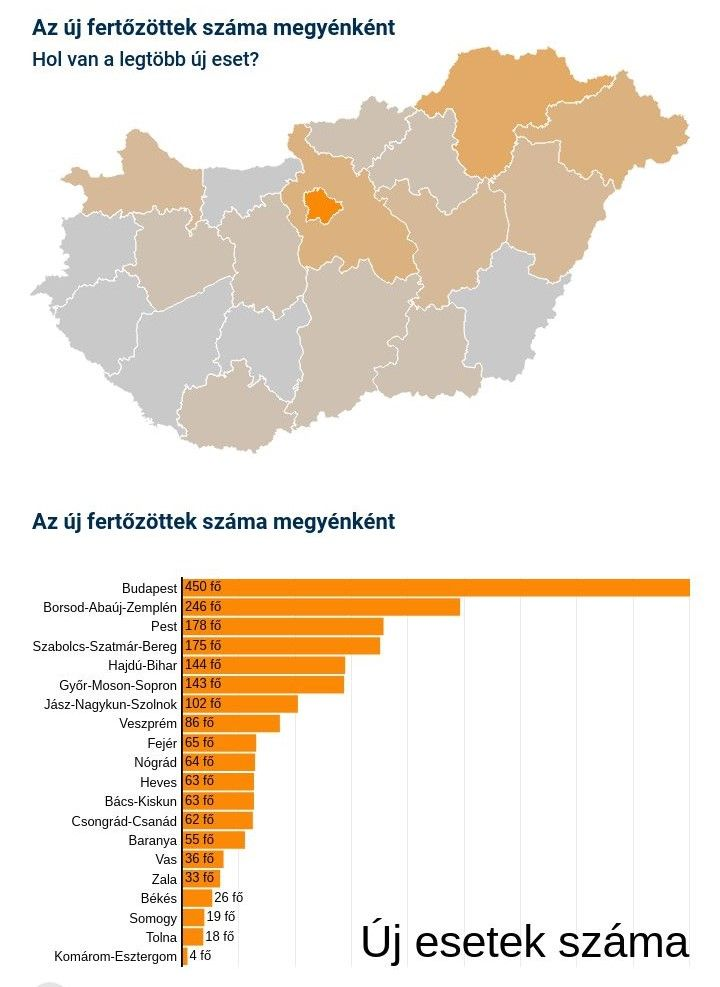

---
authors:
- Joób Sándor
categories:
- Telex
title: "Kiszámoltuk, amit a kormány nem közöl külön: hol terjed most leginkább a koronavírus?"
date: "2020-02-03"
---

> https://telex.hu/koronavirus/2020/10/22/koronavirus-fertozottseg-megyei-statisztika-uj-fertozottek-adatok-terkep

*Az elmúlt hét nap új fertőzötteinek számát százezer lakosra vetítve most az látszik, hogy a vírus leginkább Nógrád, Vas és Győr-Moson-Sopron megyében terjed.  A fertőzés terjedését mutató listában Budapest csak a hatodik helyen áll. Németország is ezt a számítási módszert veszi alapul, ezért minősítette ma Heves, Zala és Somogy megyét is beutazás szempontjából kockázatos területnek.*

Már az első hullám idején is megszokhattuk, hogy a kormány nem halmozza el adatokkal a magyar lakosságot a járvány terjedéséről, de a legszükségesebb adatokat azért naponta és rendszeresen közli. A hazai adatszolgáltatás egyik legnagyobb hiányossága, hogy a vírus terjedésének megyei eloszlásáról nem sokat tudunk. A koronavirus.gov.hu-n minden nap megjelenik egy nagyon rossz felbontású térkép, amelyen csak az eddig igazolt fertőzöttek számát tüntetik fel. Ennek nem sok értelme van, mert ez azokat is tartalmazza, akik tavasszal kapták el a fertőzést és azóta régen meggyógyultak vagy meghaltak. A térképből nem nem derül ki az sem, hogy most éppen hány aktív fertőzött van az egyes megyékben.

A naponta közzétett adatokból azonban kiszámítható az emelkedés mértéke, azaz az új fertőzöttek számát is megtudhatjuk az egyes megyékben. Ezt tanulmányozhatja ezen a térképünkön. 

Ezek a számok azonban önmagukban nem sokat jelentenek, hiszen egyértelmű, hogy az egymillió fölötti népességű Budapesten vagy Pest megyében eleve jóval több a fertőzött, mint a legkisebb lélekszámú Nógrád vagy Tolna megyében. 

Aki a járvány valódi trendjeire kíváncsi, annak érdemes másik térképünket böngészni. Ezen a megyék lakosságát figyelembe véve, százezer lakosra vetítve ábrázoltuk az elmúlt 1 hét új eseteinek számát.

A módszertan nem önkényes, ezt használja például Németországban a Robert Koch Intézet a városok, járások, tartományok és az ország fertőzöttségének vizsgálatára. A járványügyi védekezés irányításában fontos szerepet játszó intézmény napi jelentéseiben fel szokta sorolni, melyek azok a városok vagy területek, ahol 25-nél nagyobb, ahol 50-100 között van, és ahol 100 fölötti ez az érték. 

Németországban a nyáron az volt a szabály, hogy ha valahol 50 fölé emelkedett a 100 ezer lakosra számított új fertőzöttek száma az elmúlt egy hétben, ott járványügyi korlátozásokat kellett bevezetni. Ma már egész mások a nagyságrendek. A Robert Koch Intézet október 20-i jelentése szerint a bajorországi Berchtesgaden környékén 236, a Bréma közelében lévő Delmenhorstnál 211, Berlin Neukölln negyedében pedig 156 ez az érték. A jelentés angol nyelven itt olvasható. 

Ha így nézzük, Magyarországon sem túl rózsás a helyzet. Nálunk 10 megyében, Nógrádban, Vasban, Győr-Moson-Sopron megyében, Borsodban, Szabolcs-Szatmár-Bereg megyéében, valamint Budapesten, Hevesben, Hajdú-Bihar, Veszprém és Zala megyében van már 100 fölött az elmúlt egy hét új fertőzötteinek száma százezer lakosra vetítve. 

Ez alapján nem is Budapesten vagy Pest megyében terjed a legjobban a vírus. Látványos ugyan, hogy Budapesten naponta 300-400-zal is emelkedhet az új fertőzöttek száma, az arányokat nézve azonban az emelkedés mértéke a kis lélekszámú (189 ezer lakosú) Nógrádban a legmagasabb most, ahol egyébként “csak” 64 új esetet regisztráltak. 

A fenti számokat nézve nem véletlen, hogy Németország éppen a mai napon "a magas fertőzöttségi adatok” miatt Heves, Zala és Somogy megyét is kockázatosnak minősítette a koronavírus szempontjából. A hivatalos indoklás az, hogy ezekben a megyékben 50 fölé emelkedett a százezer lakosra számított új fertőzöttek száma az elmúlt hét napban. A három megyére az utazási figyelmeztetés október 24-től lép életbe. 

Ezzel már szinte az összes hazai megye és a főváros is szerepel a német külügyminisztérium kockázati listáján Békés és Fejér megye kivételével. A mostani adatokat nézve hamarosan ők is kockázatos besorolást kapnak. Bár a beutazási szabályozásban tartományonként lehetnek eltérések, általános szabály, hogy az kockázatos területekről érkezők vagy 48 óránál nem régebbi, negatív teszttel léphetek be német területre, vagy karanténba kellett vonulniuk. 

A vírus első hullámában egyértelműen Budapest volt a leginkább fertőzött. Amíg még nem álltak le a repülőjáratok és a turizmus, érthető okokból a fővárosban volt  a legnagyobb esélye a fertőzés terjedésének. Később a kormány politikai fegyverként is használta ezt Karácsony Gergely főpolgármester ellen, főként, amikor a Pesti úti idősek otthonában tömeges megbetegedések történtek. 

Némi reményre ad okot, hogy a Nemzeti Népegészségügyi Központ legújabb mérése szerint az ország nagy részén stagnál a koronavírus örökítőanyagának mennyisége a szennyvízben. Ez az innovatív megoldás eddig elég jól előre tudta jelezni 4-10 nappal a várható megbetegedési trendeket. Csökken az örökítőanyag mennyisége Békéscsabán, Székesfehérváron, Kecskeméten, Szolnokon, Budapesten és az agglomerációban, növekszik viszont a szennyvízben mért vírusszármazék mennyisége Debrecenben és Nyíregyházán.
